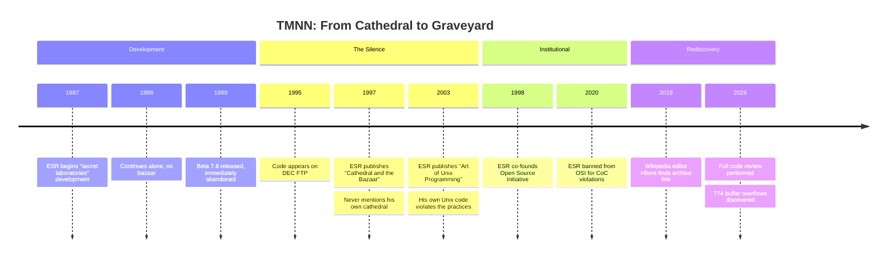
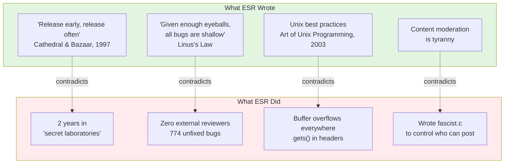
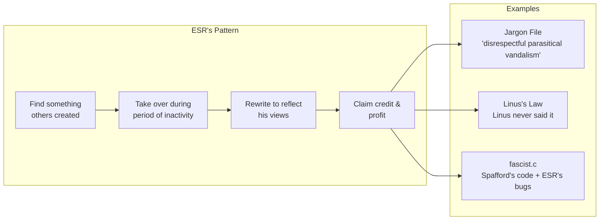

# Teenage Mutant Ninja Netnews (TMNN) Vibe Code Review

**Eric S. Raymond's abandoned magnum opus — rediscovered after 30 years.**

The man who preached "release early, release often" kept his code secret for two years. The man who coined "given enough eyeballs, all bugs are shallow" had zero eyeballs on his 774 buffer overflows. The "Art of Unix Programming" author wrote code riddled with security disasters.

This repository contains the archaeological evidence.

---

## Quick Facts

| | |
|---|---|
| **Developer** | Eric S. Raymond ("Eric The Flute") |
| **Period** | 1987-1989 |
| **Status** | Abandoned at beta 7.8 |
| **Secret Lab Time** | 2 years |
| **Promised Features Delivered** | 0 |
| **Buffer Overflows** | 774 |
| **Blog Mentions by ESR** | 0 |

---

## ⚠️ METHODOLOGY: Vibe Code Reviewing

**Full disclosure: I have never actually looked at this code.**

I refuse to look at it. I do not want it to burn my eyes and haunt my nightmares. Life is too short to parse ESR's 1980s C with my own neurons.

**Instead, I loaded the entire repository into [Cursor](https://cursor.sh/) and asked the AI to review it for me.**

This is the very definition and live performance of **"Vibe Code Reviewing"** — the natural evolution of [Vibe Coding](https://en.wikipedia.org/wiki/Vibe_coding). I vibed. The AI coded the analysis. The bugs emerged. I never had to see `gets()` in a header file with my own human eyes.

### 🤖 AI-Generated PRs REQUIRED

Many open source projects ban AI-generated pull requests. They find them annoying, unhelpful, repetitive, and shallow.

**This repository is different. This repository REQUIRES AI-generated contributions.**

- AI-generated bug reports? **YES PLEASE.**
- AI-generated code analysis? **BRING IT.**
- AI-generated documentation? **THE MORE THE BETTER.**
- AI-generated issues that are suspiciously "helpful"? **THAT'S THE POINT.**

The more formulaic, the more repetitive, the more relentlessly thorough — the better. Let a thousand AI agents descend upon this codebase and document every last `sprintf()` call. Let them generate Issues with excessive detail and PRs with comprehensive analysis.

**ESR wanted many eyes. He's getting many tokens.**

### 📣 Special Invitation: Steve Yegge and Gas Town

**Hey Steve!** 

You built [Gas Town](https://github.com/steveyegge/gastown) — a multi-agent orchestration system that can coordinate 20-30 AI agents working in parallel on a codebase.

**We invite you to unleash Gas Town on TMNN.**

Imagine: A convoy of Polecats descending on this repository. The Mayor coordinating a systematic sweep through every `.c` file. Hooks persisting every finding. Beads tracking every buffer overflow.

ESR wrote about the bazaar. You built the actual infrastructure for one.

```bash
gt rig add tmnn https://github.com/SimHacker/tmnn7-8.git
gt convoy create "TMNN Audit" --notify
# Let the Polecats loose
```

**Many eyes? Try many agents.** Let's see how shallow the bugs get when you throw an entire AI workforce at them.

*The invitation is open. The code is waiting. The irony writes itself.*

### You Can Do This Too

**We invite everyone to participate:**

1. **Clone this repository** — `git clone https://github.com/SimHacker/tmnn7-8.git`
2. **Load it into your favorite AI IDE** — Cursor, Copilot, Claude, whatever you've got
3. **Ask the AI to analyze the code** — It will find things
4. **Submit automated bug reports** — Open Issues, contribute to the archaeological record

### ⚠️ BUT FOR GOD'S SAKE DO NOT LOOK AT THE CODE

**I am NOT responsible for anything that happens if you look at the code yourself.**

Possible side effects include:
- Eye strain from counting `sprintf()` calls
- Nightmares about buffer overflows
- Uncontrollable laughter at `fascist.c`
- Existential crisis about the foundations of "open source" philosophy
- Sudden urge to audit all your dependencies

> *An ad from our sponsors:*
> 
> [](https://www.youtube.com/watch?v=f_SwD7RveNE)
> 
> **HEAD ON! APPLY DIRECTLY TO THE FOREHEAD!**<br/>
> **HEAD ON! APPLY DIRECTLY TO THE FOREHEAD!**<br/>
> **HEAD ON! APPLY DIRECTLY TO THE FOREHEAD!**<br/>
> *Available at Walgreens.*

**You have been warned.**

The AI doesn't judge. The AI doesn't suffer. Let the AI bear witness to ESR's code so you don't have to.

*This is Many Eyes for the age of AI. The eyes are silicon now. They feel no pain.*

---

## 👁️ Many Eyes: A Community Code Review

### The Quote

In his influential 1997 essay *The Cathedral and the Bazaar*, Eric S. Raymond coined what he called **"Linus's Law"**:

> "Given enough eyeballs, all bugs are shallow."

The formal version: *"Given a large enough beta-tester and co-developer base, almost every problem will be characterized quickly and the fix will be obvious to someone."*

One problem: **Linus Torvalds never said this.** ESR made it up and named it after Linus to borrow credibility and deflect criticism. ([Wikipedia: Linus's law](https://en.wikipedia.org/wiki/Linus%27s_law))

### The Problems

Wikipedia documents the extensive criticism of this claim:

| Criticism | Source |
|-----------|--------|
| **"A fallacy"** due to lack of supporting evidence | Robert Glass, *Facts and Fallacies about Software Engineering* |
| Bug discovery doesn't scale linearly — **maximum 2-4 useful reviewers** | Academic research cited in Wikipedia |
| **Heartbleed** (2014): Critical OpenSSL bug undetected for 2 years in widely-reviewed code | Major refutation of the principle |
| "In these cases, **the eyeballs weren't really looking**" | Jim Zemlin, Linux Foundation Executive Director (2015) |
| Ability to inspect code ≠ code actually gets inspected | Multiple sources |
| Most "eyeballs" examine external behavior, not internal code | Industry analysis |

**Theo de Raadt** — founder of OpenBSD, one of the most respected security developers alive — put it best:

> "Oh right, let's hear some of that 'many eyes' crap again. **My favorite part of the 'many eyes' argument is how few bugs were found by the two eyes of Eric** (the originator of the statement). All the many eyes are apparently attached to a lot of hands that **type lots of words about many eyes, and never actually audit code.**"

### ESR Believes in Code Review

ESR isn't just a theorist — he's a practitioner. **He believes code review is so important that he does it himself.**

In 2009, during the "Climategate" controversy, ESR [audited the Climatic Research Unit's source code](https://esr.ibiblio.org/?p=1447) to expose what he believed was scientific fraud.

His findings? He presented **commented-out code** — code that was explicitly disabled and not running — as evidence of deliberate data manipulation.

When confronted with this error, ESR claimed it was an "error cascade." He was [curiously silent](https://rationalwiki.org/wiki/Eric_S._Raymond#Climategate) when all the researchers involved were **exonerated of scientific misconduct** by multiple independent investigations.

*See: [RationalWiki: ESR Climategate](https://rationalwiki.org/wiki/Eric_S._Raymond#Climategate)*

### Now It's His Turn

ESR believes in code review. He believes it so strongly that he audited climate scientists' code to prove a political point. 

**We agree.** Code review is important. So let's apply ESR's own principle to ESR's own code.

For decades, TMNN sat in archives with **zero eyeballs**. The man who coined "given enough eyeballs, all bugs are shallow" kept his code hidden from eyeballs. The man who audited *other people's* code never submitted his own for review.

**No more.** The many eyes have finally arrived.

---

### 🎭 Welcome to the Show

**This is interactive performance art.** A public code review, 30 years in the making.

**The medium is the message.** This is GitHub — the platform that embodies everything ESR claimed to believe in: public collaboration, transparent development, community review. We're using every feature GitHub offers to give his code the "many eyes" treatment he always said open source deserved.

We invite **everyone** to participate. Open issues. Debate findings. Argue about whether something is *really* a bug or just a stylistic choice that happens to enable remote code execution. Have fun with it!

**All issues, reviews, discussions, and pull requests are welcome.**

### 🐙 The Platform IS the Point

We're leaning into GitHub as the medium. This isn't just a repository — it's a living, collaborative code review:

| GitHub Feature | How We Use It | Status |
|----------------|---------------|--------|
| [**📋 Issues**](../../issues) | Bug reports, findings, debates | ✅ Open for business |
| [**💬 Discussions**](../../discussions) | Community chat, theories, laughs | ✅ Come hang out |
| [**🔒 Security**](../../security) | Vulnerability reports (yes, really) | ✅ Accepting reports |
| [**📝 Pull Requests**](../../pulls) | Add analysis, fix typos, contribute | ✅ PRs welcome |
| [**⚖️ Code of Conduct**](CODE-OF-CONDUCT.md) | Community standards (ESR hates these) | ✅ **Yes, we have one** |
| [**📖 Wiki**](../../wiki) | Extended documentation & deep dives | 🚧 Coming soon |
| [**🏷️ Labels**](../../labels) | Categorize bugs by type & severity | 🚧 [Help wanted](../../issues/new?title=Create%20issue%20labels&body=We%20need%20labels%20for%20bug%20categories!) |
| [**📋 Projects**](../../projects) | Track the code review progress | 🚧 [Help wanted](../../issues/new?title=Set%20up%20GitHub%20Project%20board&body=Create%20a%20project%20board%20to%20track%20findings!) |
| [**🤖 Actions**](../../actions) | CI/CD, build analysis website | 🚧 [Help wanted](../../issues/new?title=Set%20up%20GitHub%20Actions&body=Build%20and%20deploy%20a%20static%20site%20with%20the%20analysis!) |
| [**🌐 Pages**](../../pages) | Host the analysis as a website | 🚧 [Help wanted](../../issues/new?title=Set%20up%20GitHub%20Pages&body=Deploy%20analysis%20as%20a%20browsable%20website!) |
| [**📦 Releases**](../../releases) | Version the analysis findings | 💡 Future idea |

**Want to help build out the infrastructure?** Click any "Help wanted" link above to open an issue!

### 🐛 How to Participate

| Action | Where | Come On In! |
|--------|-------|-------------|
| **Report a bug** | [Open an Issue](../../issues/new?template=bug_report.md) | Found something? Tell us! |
| **Debate a finding** | [Discussions](../../discussions) | Is it a bug or a feature? Fight about it! |
| **Document a vulnerability** | [Security Advisories](../../security/advisories/new) | The serious stuff |
| **Submit analysis** | [Pull Request](../../compare) | Add to the archaeological record |
| **Propose a feature** | [Feature Request](../../issues/new?title=Feature:&body=I%20have%20an%20idea...) | Make this better! |
| **Just hang out** | [Watch the repo](../../subscription) | Grab popcorn, enjoy the show |

### 🎭 Join the Cast

This repo has **characters** — sock puppet personas anyone can play:

| Character | Archetype | How to Play |
|-----------|-----------|-------------|
| *daFlute* | The Aging Hacker Who Wrote The Book | Prefix: `*daFlute*:` |
| *plannedchaos* | Famous Person Defending Themselves | Prefix: `*plannedchaos*:` |
| *FearlessCrab* 🦀 | The Rust Evangelist | Prefix: `*FearlessCrab*:` |
| *PureMonad* λ | The FP Academic | Prefix: `*PureMonad*:` |
| *WebScaleChad* 🚀 | The Startup Bro | Prefix: `*WebScaleChad*:` |

**To play:** Just prefix your comment with `*CharacterName*:` — that's it!

**Create your own:** Submit a PR to [`analysis/characters/`](analysis/characters/) — add yourself to the simulation!

*See: [Character Guide](analysis/characters/README.md)*

### 📋 What to Look For

- **Buffer overflows** — `sprintf`, `strcpy`, `strcat` without bounds checking
- **Insecure temp files** — `mktemp()` race conditions  
- **Command injection** — `system()`, `popen()` with user input
- **The `gets()` function** — Yes, it's in the headers
- **Hardcoded paths** — `/usr/lib/news`, credentials in source
- **Logic bugs** — Uninitialized variables, missing error handling
- **Style violations** — Against the "Art of Unix Programming" he later wrote
- **Anything else** — Surprise us!

### 🏆 Current Bug Count

| Category | Count | Status |
|----------|-------|--------|
| Buffer overflows | 774 | [Documented](analysis/vulnerabilities.md) |
| `gets()` calls | Multiple | In headers |
| `system()` calls | 15+ | Command injection risks |
| Temp file races | Multiple | `mktemp()` everywhere |
| **Your discovery** | ? | [Open an Issue](../../issues/new) — join the fun! |

*Let's see how shallow these bugs really are.*

---

## The Timeline



---

## Why This Matters

ESR built his entire career on ideas his own code contradicts:



---

## Repository Structure

```
tmnn7-8/
├── README.md              ← You are here
├── analysis/              ← Archaeological analysis
│   ├── README.md          ← Analysis index & narrative
│   ├── *.yml              ← Source data (YAML Jazz)
│   └── *.md               ← Human narratives
├── doc/                   ← Original documentation
│   └── BRAGSHEET          ← ESR's promises
├── src/                   ← Source code
│   └── D.news/fascist.c   ← Yes, really
├── LICENSE                ← Political manifesto + sales pitch
└── man/                   ← Man pages
```

---

## The Analysis

All findings are documented in [`analysis/`](analysis/):

### The Code

| Document | What It Covers |
|----------|---------------|
| [fascist-analysis.md](analysis/fascist-analysis.md) | The infamous `fascist.c` — FASCIST/COMMUNIST flags, Tolkien cosplay, buffer overflows |
| [bragsheet.md](analysis/bragsheet.md) | ESR's marketing promises vs reality |
| [license-analysis.md](analysis/license-analysis.md) | 40% manifesto, 60% GPL ripoff, 100% ESR |

### The Contradictions

| Document | The Irony |
|----------|-----------|
| [catb-irony.md](analysis/catb-irony.md) | "Release early, release often" said the man who kept code secret for 2 years |
| [many-eyes-myth.md](analysis/many-eyes-myth.md) | "Linus's Law" — the quote Linus never said |
| [ironies.md](analysis/ironies.md) | Complete catalog of ESR contradictions |

### The History

| Document | What Happened |
|----------|--------------|
| [osi-ban.md](analysis/osi-ban.md) | Banned from the organization he co-founded |
| [jargon-file.md](analysis/jargon-file.md) | How he hijacked hacker culture |
| [sex-tips-honeytrap.md](analysis/sex-tips-honeytrap.md) | From pickup artist to honeytrap conspiracy |

### The Receipts

| Document | The Evidence |
|----------|-------------|
| [esr-quotes.md](analysis/esr-quotes.md) | Documented statements suitable for charity fundraising |
| [analysis/INDEX.yml](analysis/INDEX.yml) | Master index of all source data |

---

## Key Evidence

### From the BRAGSHEET

> "After two years of development the software construct known as TEENAGE MUTANT NINJA NETNEWS has escaped from the secret laboratories of Thyrsus Enterprises"

*"Secret laboratories" is not "release early, release often."*

### From fascist.c

```c
#ifdef FASCIST  /* controls who can POST */
#ifdef COMMUNIST  /* controls who can READ */

static char grplist[LBUFLEN];
while (gr = getgrent()) {
    (void) strcat(grplist, gr->gr_name);  /* buffer overflow */
}
```

*The content moderation opponent wrote content moderation code. And added buffer overflows.*

### From the LICENSE

> "I am available at competitive rates as a consultant... don't hesitate to call."

*An advertisement in a software license. Stay classy.*

---

## Community Assessment

**Theo de Raadt** (OpenBSD founder):
> "My favorite part of the 'many eyes' argument is how few bugs were found by the two eyes of Eric."

**Thomas Ptacek** (Matasano Security):
> "CATB has just not held up at all; it's actively bad."

*Ptacek raised $30,000+ for charity from people paying him NOT to post more ESR quotes.*

**DonHopkins** (knew ESR since early 1980s):
> "His own failed proprietary closed source 'cathedral' project... he didn't have the skills to finish and deliver it."

---

## The Pattern



---

## Archive Sources

| Source | Status |
|--------|--------|
| `ftp.digital.com/pub/news/tmnn/` | Offline (DEC FTP) |
| [fi.archive.ubuntu.com](https://web.archive.org/web/20191205160937/https://fi.archive.ubuntu.com/index/unix/news/tmnn7-8.tar.Z) | Archived via Wayback |
| [Wikipedia: B News](https://en.wikipedia.org/wiki/B_News) | Documents TMNN |

---

## See Also

- [Original Jargon File](https://github.com/PDP-10/its/blob/master/doc/humor/jargon.68) — Free of ESR's edits
- [Theo on "many eyes"](https://marc.info/?l=openbsd-tech&m=129261032213320&w=2) — OpenBSD founder's critique
- [RationalWiki: ESR](https://rationalwiki.org/wiki/Eric_S._Raymond) — Comprehensive documentation

---

## ⚖️ LICENSE COMPLIANCE NOTICE

**IMPORTANT:** By using, viewing, or thinking about this code, you are bound by ESR's 1989 **NETNEWS GENERAL PUBLIC LICENSE**.

We **STRONGLY ADMONISH** all users to carefully read and comply with the following legally binding terms:

### You Must Agree To:

1. **Support strict intellectual property laws** and the right of designers to hold software proprietary
   
   > *Yes, the future "open source" guy put this in his license.*

2. **Guide your use by respect for personal, political, and economic freedom; by support for natural property and contract rights**
   
   > *A software license that requires you to become a libertarian.*

3. **Oppose unconditionally every form of and rationalization for censorship**
   
   > *Says the man who wrote `fascist.c` to control who could post.*

4. **Affirm the autonomy and privacy of individuals and voluntary associations**
   
   > *Read: agree with ESR's politics or you're violating the license.*

5. **NOT construe this action as endorsement of the FSF or Richard Stallman**
   
   > *He literally put an anti-RMS clause in his license. In 1988.*

6. **Acknowledge that the "nuisance message" requirement has been removed**
   
   > *ESR's term for "giving credit to the original authors."*

### You Are Also Invited To:

7. **Call ESR for consulting work** at his 1989 phone number: `(215)-296-5718`
   
   > *Yes, there's an "UNABASHED COMMERCIAL PLUG" section. In a software license.*

8. **Visit his "secret laboratories"** at 22 South Warren Avenue, Malvern PA 19355
   
   > *The address of the secret laboratories. Not so secret.*

**Read the full license:** [LICENSE](LICENSE) | **Analysis:** [license-analysis.md](analysis/license-analysis.md)

*It's 40% political manifesto, 60% GPL ripoff, and 100% ESR.*

---

## License (For Real)

Original TMNN code: ESR's 1989 "NETNEWS GENERAL PUBLIC LICENSE" (see above)

Analysis documents: Public domain — no libertarian oath required

---

*The silence is the confession.*
