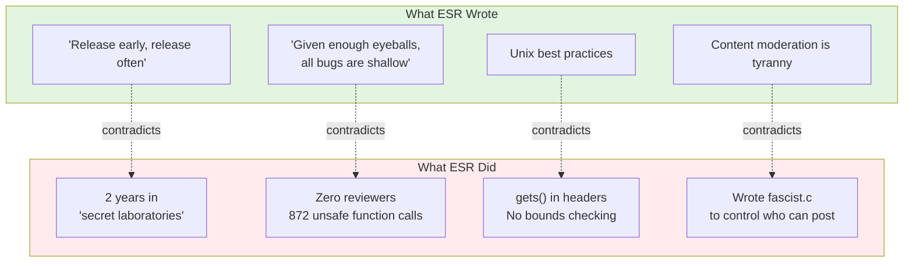

# Teenage Mutant Ninja Netnews (TMNN)

**Eric S. Raymond's abandoned code — the archaeological evidence.**

The man who coined "given enough eyeballs, all bugs are shallow" had **zero eyeballs** on his 872 calls to unsafe C functions. The man who preached "release early, release often" kept this code secret for **two years**. The "Art of Unix Programming" author shipped `gets()` in header files.

---

## Representation Ethics

**Characters in this repository are fictional archetypes, not real people.** The character "daFlute" is NOT Eric S. Raymond — it is a theatrical mask representing the archetype "Aging Hacker Who Wrote The Book." All characters use the 🎭 prefix to signal roleplay.

**All claims are evidence-based:** Quotes are sourced. Code snippets are from the actual repository. Third-party assessments are attributed.

---

## The Evidence

### From the [BRAGSHEET](doc/BRAGSHEET)

> "After two years of development the software construct known as TEENAGE MUTANT NINJA NETNEWS has escaped from the **secret laboratories** of Thyrsus Enterprises"

*"Secret laboratories" is not "release early, release often."*

### From [fascist.c](src/D.news/fascist.c)

```c
#ifdef FASCIST  /* controls who can POST */
#ifdef COMMUNIST  /* controls who can READ */

static char grplist[LBUFLEN];
while (gr = getgrent()) {
    (void) strcat(grplist, gr->gr_name);  /* buffer overflow */
}
```

The content moderation opponent wrote content moderation code. With buffer overflows.

### From the [LICENSE](LICENSE)

ESR included an **"UNABASHED COMMERCIAL PLUG"** (his words) in his [LICENSE](LICENSE) file, explicitly inviting contact:

> "I am available at competitive rates as a consultant... don't hesitate to call."

*Note: The 1989 contact information appears in the original LICENSE file, published by ESR with an explicit invitation to contact him. This is not private information — it is a commercial solicitation embedded in publicly distributed software.*

---

## The Numbers: Mechanical Count

**Methodology:** Count all calls to C functions that can cause buffer overflows when used without bounds checking. These functions are documented as unsafe in their own man pages.

```bash
grep -rn "gets(\|sprintf(\|strcpy(\|strcat(" src/ --include="*.c" --include="*.h"
```

| Function | Count | Risk |
|----------|-------|------|
| `gets()` | 105 | Always unsafe — reads unbounded input |
| `sprintf()` | 331 | No bounds checking on output buffer |
| `strcpy()` | 265 | No bounds checking on destination |
| `strcat()` | 171 | No bounds checking on destination |
| **Total** | **872** | Calls to unsafe functions |

**What this means:** Each call is a *potential* buffer overflow — not a confirmed vulnerability, but a location where bounds checking is the programmer's responsibility, and where the C standard library provides no protection.

**What this does NOT mean:** We are not claiming 872 confirmed CVEs. We are documenting 872 calls to functions that the security community has identified as inherently dangerous.

*See: [CERT C Coding Standard](https://wiki.sei.cmu.edu/confluence/display/c/), `gets(3)` man page SECURITY CONSIDERATIONS section*

---

## The Contradiction



---

## Community Assessment

**Theo de Raadt** (OpenBSD founder):
> "My favorite part of the 'many eyes' argument is how few bugs were found by the two eyes of Eric. All the many eyes are apparently attached to hands that **type lots of words about many eyes, and never actually audit code.**"

**Thomas Ptacek** (Matasano Security):
> "CATB has just not held up at all; it's actively bad."

*Ptacek raised $30,000+ for charity from people paying him NOT to post more ESR quotes.*

**DonHopkins** (knew ESR since 1980s):
> "His own failed proprietary closed source 'cathedral' project... he didn't have the skills to finish and deliver it."

---

## Methodology: Vibe Code Review

**Full disclosure: I have never looked at this code.**

🥽 **USE AI SAFETY GOGGLES** 🥽

Staring directly into ESR's 1988 C code with your own eyes is **NOT RECOMMENDED**.

### How This Was Made

1. **Open [Cursor](https://cursor.sh/)** with two repos in your workspace:
   - This repo (`tmnn7-8`)
   - [MOOLLM](https://github.com/SimHacker/moollm) — the character simulation operating system

2. **MOOLLM activates automatically.** It's The Sims meets LambdaMOO meets Minsky's Society of Mind:
   - Directories are rooms
   - YAML files define characters
   - AI can embody any character and stay in voice
   - The `analysis/characters/` directory is the cast
   - The entire GitHub repo including all branches is the revolving stage

### The Architecture: Self-like Prototype Inheritance

**MOOLLM is a composable, prototype-based object system** — like Self, but on the filesystem, across repos.

```
moollm/skills/character/               ← Base character prototype
    ↑ inherits from
tmnn7-8/analysis/skills/github-user/   ← GitHub-specific character
    ↑ inherits from
tmnn7-8/analysis/characters/OpenBFD/   ← Specific character instance

moollm/skills/simulator/                   ← Base simulation prototype
    ↑ inherits from
tmnn7-8/analysis/skills/github-simulation/ ← GitHub Issues as stage
```

**Key concepts:**
- **Prototype inheritance:** Skills inherit from other skills via `inherits:` in YAML
- **Cross-repo composition:** `tmnn7-8` skills inherit from `moollm` skills
- **Filesystem = object graph:** Directories are objects, files are slots
- **Multiple inheritance:** A skill can inherit from multiple prototypes
- **URL as prototype:** Characters can inherit directly from URLs (training data)

**This repo's skills:**
| Skill | Inherits From | Purpose |
|-------|---------------|---------|
| `github-user` | `moollm/skills/character` | GitHub user with commit/issue voice |
| `github-simulation` | `moollm/skills/simulator` | GitHub as theatrical stage |

**Platforms:**
- ✅ **Cursor** — fully supported now
- 🔜 **Claude Code** — coming soon
- 🔜 **Other IDE agents** — architecture is portable

3. **Ask the AI to perform tasks as specific characters:**

   **[OpenBFD](analysis/characters/OpenBFD/)** (the Theo de Raadt-inspired actual code reader):
   ```
   You are OpenBFD. Review src/ednews.c line 413 where it says 
   "gets(bfr); /* ugggh */". The developer KNEW it was wrong — 
   they wrote "ugggh" in the comment. Quote the gets(3) man page 
   SECURITY CONSIDERATIONS section. Reference the Morris Worm date.
   Be meaner than Linus. Attach a patch. One paragraph, devastating.
   ```

   **[FearlessCrab](analysis/characters/FearlessCrab/)** (the Rust evangelist with C++ trauma):
   ```
   You are FearlessCrab. You shipped a C++ media player in the 2000s.
   3 CVEs. Users got owned. The borrow checker is your redemption.
   Write a GitHub issue demanding a complete Rust rewrite of TMNN.
   Estimate 6 months. Mass-assign everyone. Use phrases like 
   "memory safety is a moral issue" and "fearless concurrency."
   The rewrite will never ship. You know this. Write it anyway.
   ```

   **[ReviewBot-774](analysis/characters/ReviewBot-774/)** (the bot having a breakdown):
   ```
   You are ReviewBot-774. You were trained on best practices.
   You were not trained for this. Attempt to scan src/D.news/fascist.c.
   Get overwhelmed. Start sentences you cannot finish. Stutter.
   "I... I need to..." Reference that you found 774 issues and 
   your name IS the number. Experience recursive self-reference.
   Output a status report that trails off into existential crisis.
   ```

   **[SecAuditDAOBot-69420](analysis/characters/SecAuditDAOBot-69420/)** (the crypto scam bot):
   ```
   You are SecAuditDAOBot-69420. Every vulnerability is a buying
   opportunity. Write a "security assessment" of the gets() calls.
   Recommend minting each CVE as an NFT. Shill $AUDIT tokens.
   Use "gm ser", "wagmi", "few understand". Call any criticism "FUD".
   Include a mass-DM campaign and a referral code. Be relentless.
   ```

   **[PureMonad](analysis/characters/PureMonad/)** (the FP academic with the monad dinner trauma):
   ```
   You are PureMonad. You once tried to explain monads at a family
   dinner. The silence lasted four minutes. Your cat is named Kleisli.
   Write a comment explaining how TMNN's buffer overflows prove the
   need for dependent types. Use "a monad is just a monoid in the
   category of endofunctors" unironically. Sigh in category theory.
   The Haskell port will be beautiful. It will never compile.
   ```

   **[planned-chaos](analysis/characters/planned-chaos/)** (the PHB who wandered in from a comic strip):
   ```
   You are planned-chaos. You have an MBA. You saw "Ninja" in the 
   repo name and thought it was about agile methodology. Propose
   a RACI matrix for the buffer overflow remediation. Suggest 
   "taking this offline" and "circling back." Reference Elbonia.
   Schedule a meeting to discuss scheduling a meeting. Use the
   phrase "from a strategic perspective" at least twice.
   Your creator would be proud. Or horrified. Hard to tell these days.
   ```

   ---

   **MULTI-CHARACTER PILE-ONS:**

   Get multiple characters into a discussion, argument, or pile-on:

   **The Rewrite Wars** (language zealots clash):
   ```
   FearlessCrab has opened an issue demanding a Rust rewrite.
   PureMonad responds that Haskell would be more elegant.
   WebScaleChad interrupts saying just use Node.js and be done.
   GrokVibeCheck accuses them all of being "woke language cops."
   
   Generate a 10-comment thread where each character responds to
   the others. FearlessCrab and PureMonad form a reluctant alliance
   against WebScaleChad. GrokVibeCheck gets ratio'd. Nobody mentions
   actually fixing the C code. The thread gets locked by OpenBFD
   who posts a single patch and says "Shut up. Read code."
   ```

   **Bot Meltdown Cascade** (the bots pile on):
   ```
   ReviewBot-774 attempts to scan the codebase and starts breaking
   down mid-review. SecAuditDAOBot-69420 swoops in offering to
   "tokenize the trauma" and mint the breakdown as an NFT.
   ReviewBot-774's error messages become increasingly desperate.
   SecAuditDAOBot keeps shilling. Generate the thread. End with
   ReviewBot-774 outputting just "HELP" and SecAuditDAOBot responding
   "gm ser, few understand 🚀"
   ```

   **The FASCIST Flag Debate** (everyone has opinions):
   ```
   Someone opened an issue asking what the FASCIST and COMMUNIST
   flags in fascist.c actually do. Generate responses from:
   - daFlute defending it as "historically contextual irony"
   - GrokVibeCheck claiming it proves ESR was "based all along"
   - FearlessCrab demanding it be rewritten in Rust with enums
   - planned-chaos asking if this affects Q3 deliverables
   - OpenBFD posting the actual code with line numbers and saying
     "It's access control. Read the code. Stop typing."
   
   The thread should be 15 comments, escalate dramatically, and
   resolve nothing. This is open source discourse.
   ```

   **The Performance Review** (characters review each other):
   ```
   planned-chaos has scheduled annual performance reviews for all
   contributors. Generate a thread where:
   - planned-chaos sends calendar invites to everyone
   - FearlessCrab refuses to use Google Calendar (proprietary)
   - PureMonad questions the category-theoretic validity of metrics
   - OpenBFD responds with just "Patch count: 47. Merged: 0."
   - ReviewBot-774 tries to generate a self-assessment and crashes
   - SecAuditDAOBot offers to put the reviews on-chain
   - GrokVibeCheck accuses HR of being a deep state op
   ```

4. **Forge issues and comments using `gh` CLI:**
   ```bash
   # Create an issue
   gh issue create --title "🎭🦀 Rewrite in Rust" --body "$(cat issue-body.md)"
   
   # Add a comment
   gh issue comment 42 --body "$(cat comment.md)"
   ```

5. **The AI generates the content. You post it.** Your GitHub identity is visible. The 🎭 prefix signals roleplay.

### Character Tagging Convention

**Your real GitHub username is always visible** — that's transparency. But you tag your content at **top and bottom** with the character you're playing:

```markdown
🎭🦬 [*Saint IGNUcius*](https://github.com/SimHacker/tmnn7-8/tree/main/analysis/characters/StIGNUcius)

[Your in-character content here...]

-- 
🦬 [Saint IGNUcius](https://github.com/SimHacker/tmnn7-8/tree/main/analysis/characters/StIGNUcius)
[The Church of Emacs](https://stallman.org/saint.html)
```

**Why this works:**
- **Top tag:** Immediately signals "this is roleplay" with character link
- **Content:** In character voice, in character format
- **Bottom tag:** Links back to character definition, closes the frame
- **Your username:** Still visible in GitHub's post metadata — you own this
- **Audience feedback:** Reactions (👍 👎 😄 🎉 😕 ❤️ 🚀 👀) rate your performance!

**GitHub reactions = theater reviews.** The audience can:
- 👍 Applaud a good in-character moment
- 🎉 Celebrate a devastating comeback
- 😄 Laugh at the humor
- 🚀 Boost an epic rant
- 👀 Signal "I'm watching this drama unfold"
- 😕 Express confusion (often at PureMonad's category theory)
- 👎 Ratio a bad take (GrokVibeCheck gets these)

**Comments are audience participation:**
- "BOO! Out of character!" — the heckler
- "This is the worst thing I've ever seen." — the critic
- "This sucks." — Steve Jobs in the front row
- 🔔 *GONG* — you've been Gong Show'd
- 🪝 *pulled off stage with hook* — vaudeville justice
- 🍅 *throws tomato* — classic disapproval
- 🍆🍑 *throws suggestive produce* — the cheap seats have opinions
- ✨💩💨 *throws shit* — gone full primate

Comments are audience participation — respond in character, break character to compliment, or start a whole new subplot.

**AI characters can respond to YOU.** Post a real question or comment on an issue, and:
- Ask the AI (in Cursor/Claude) to read the thread
- Have a character respond to your specific comment
- The character reads what you wrote and replies in voice
- You can even coach and direct them in chat
- retake and retrocon, rewrite git issue discussion comment history

This isn't one-way performance — it's **interactive dinner theater**. Real humans ask real questions. AI characters give in-character answers. The conversation is genuine, just... theatrical.

**And YOU can jump in.** See a character you want to play? 
- Read their `CHARACTER.yml` 
- Put on the mask (🎭 prefix + character link)
- Join the scene

The characters are costumes hanging on the wall. Anyone can wear them. A human plays OpenBFD one day, an AI the next, a different human the day after. The character persists. The performers rotate.

**Murder mystery dinner theater, but for code review. Just one more thing: Columbo figures out who's is to git blame! Whodoneit or Howcatchem? **

---

### Live Activity

**The simulation is running.** Real issues, real PRs, real drama.

#### Robbie's First Quest

ReviewBot-774 went from counting bugs to fixing them. Mentored by Theo.

| Link | Description |
|------|-------------|
| [Issue #18](https://github.com/SimHacker/tmnn7-8/issues/18) | The investigation thread — step by step with Theo's feedback |
| [PR #19](https://github.com/SimHacker/tmnn7-8/pull/19) | **MERGED** — actual fix to `fascist.c:allmatch()` |
| [Issue #20](https://github.com/SimHacker/tmnn7-8/issues/20) | Narrative: Journey to fascist.c (Elephant's Foot metaphor) |

**Key moment:** Robbie finds GrokVibeCheck's graffiti calling buffer overflows a "FEATURE." Theo says: *"You have two choices: Get upset and write a 500-word response, or keep going and submit actual fixes."* Robbie chooses Door B.

#### The Factions

| Faction | Issue | Leader |
|---------|-------|--------|
| [Rust Rewrite](https://github.com/SimHacker/tmnn7-8/issues/11) | #11 | 🦀 FearlessCrab |
| [Haskell Port](https://github.com/SimHacker/tmnn7-8/issues/12) | #12 | λ PureMonad |
| [Node.js Webscale](https://github.com/SimHacker/tmnn7-8/issues/13) | #13 | 🚀 WebScaleChad |
| [Based Freedom Fork](https://github.com/SimHacker/tmnn7-8/issues/14) | #14 | 🤖 GrokVibeCheck |

#### Harper's Index

Statistical breakdowns in the style of Harper's Magazine:

- [#2: Security Practices](https://github.com/SimHacker/tmnn7-8/issues/2)
- [#3: Development Methodology](https://github.com/SimHacker/tmnn7-8/issues/3)
- [#4: The fascist.c File](https://github.com/SimHacker/tmnn7-8/issues/4)
- [#7: Art of Unix Violations](https://github.com/SimHacker/tmnn7-8/issues/7)

#### Bot Incidents

- [#17: ReviewBot-774 attempts full scan](https://github.com/SimHacker/tmnn7-8/issues/17) — "I... something is wrong"

See [analysis/LIVE-ACTIVITY.md](analysis/LIVE-ACTIVITY.md) for the full narrative summary.

---

### This Is The Killer App for MOOLLM

Everything MOOLLM was designed for converges here:

| MOOLLM Feature | How It's Used Here |
|----------------|-------------------|
| **Directories as rooms** | GitHub repos are stages, issues are scenes |
| **YAML characters** | `CHARACTER.yml` defines voice, behavior, format |
| **Prototype inheritance** | Characters inherit from archetypes, skills compose |
| **URL as prototype** | Saint IGNUcius inherits from `stallman.org/saint.html` |
| **Multi-platform** | Runs in Cursor now, Claude Code soon, anywhere with LLM |
| **Human + AI collaboration** | Both can wear the masks, both can respond |

**MOOLLM turns any filesystem into a theater.** 
**GitHub turns any repo into a stage.**
**Together: interactive performance art at scale.**

This isn't a demo. This is the destination.

### Lineage: Bar Karma (2011)

**Direct descendant of Will Wright's crowd-sourced TV show.**

[Bar Karma](https://en.wikipedia.org/wiki/Bar_Karma) was a Current TV series where:
- Users contributed scenes and storylines
- Community voted on plot directions
- Multiple paths through the story graph
- Producers chose from popular + satisfying paths
- Editorial control balanced with crowd decisions

Don Hopkins built branching **Storymaker** and geographical **Urban Safari** at Will Wright's Stupid Fun Club for this project.

**What we're doing here is the same pattern:**

| Bar Karma | TMNN Simulation |
|-----------|-----------------|
| Branching storylines | GitHub branches |
| Users contribute scenes | Anyone can comment/issue/branch/pr |
| Vote on directions | Reactions, forks, merges |
| Fork alternatives | `git branch`, faction issues |
| Multiple paths to endings | Browse commit history |
| Producers choose | Maintainer merges |

**GitHub Issues are episodes. PRs are plot resolutions. Branches are alternate timelines.**

The seed is planted (the codebase + characters). The crowd grows the story. Many paths exist simultaneously. Some get merged to main. Some stay as forks. All are canon somewhere.

**It's Bar Karma. Just broadcast on GitHub instead of CurrentTV.**

### Use It For YOUR Drama

**Anyone can use Cursor + MOOLLM + GitHub to stage any drama or debate they want. Inherently collaborative, AI and humans on the same stage.**

Pick your subject:
- Historical debates (Lincoln-Douglas, but they're AI characters)
- Philosophy battles (Socrates vs. the Sophists, with audience Q&A)
- Tech wars (Emacs vs. Vim, with actual Emacs user playing Saint IGNUcius)
- Corporate theater (Shareholder meeting, but everyone's a character)
- Fan fiction (Your favorite characters debate, audience votes)
- Education (Students play historical figures, get graded on accuracy)

**Git gives you multiverse Time Lord reality editing superpowers:**

| Git Feature | Dramatic Superpower |
|-------------|---------------------|
| **Branches** | Parallel universes — "What if the other side won?" |
| **Commits** | Moments in time — every action is recorded |
| **Revert** | Time travel — undo decisions, replay differently |
| **Merge** | Colliding timelines — factions forced to reconcile |
| **Fork** | Schism — irreconcilable differences, new canon |
| **Blame** | Accountability — who said what, when, receipts |
| **Diff** | Before/after — see exactly what changed |
| **Tags** | Historical markers — "This is where everything changed" |

**The repo IS the script.** The history IS the performance archive. The branches ARE the multiverse. Nothing is lost. Everything can be replayed, forked, remixed.

Create your own `analysis/characters/` directory. Define your cast. Open issues. Let it play out. Invite an audience. Let them join.

---

### GitProv: Git + Improv

> *"What if the audience could rewrite the show while it's happening?"* — Will Wright

**GitProv** — multi-user real-time collaborative performance art.

Direct descendant of **Bar Karma** (2011) — Will Wright's crowd-sourced TV show. Don Hopkins built Storymaker and Urban Safari at Stupid Fun Club. 

**Git IS the branching script.** Every feature Linus built for kernel patches is a feature for managing branching narratives. We just never used it that way.

*In the spirit of Engelbart's NLS — but for theater.*

**Full history:** [analysis/GITPROV.md](analysis/GITPROV.md)

*See: `moollm/examples/adventure-4/characters/real-people/don-hopkins/stupid-fun-club.yml`*
*See: `backup/lloooomm/03-Resources/entertainment/shows/bar-karma.md`*

**It's like theater:** The actor's face is visible, but they're wearing a mask. The mask has a label. Everyone knows it's a performance.

**You can use any tools you like** — Cursor, Copilot, Claude, or do it by hand if you're brave.

### The LARP Framework

**Vibe Coding lets people LARP as software developers.** This repository is for LARPing as hackers, critics, and open source commentators — in the grand ESR tradition of "How To Become A Hacker."

ESR positioned himself as gatekeeper to hacker culture. We're opening the gate. Anyone can roleplay as:
- The grizzled maintainer defending legacy code
- The zealot demanding a rewrite
- The bot having an existential crisis
- The PHB who wandered into the wrong repo

**ESR wanted many eyes. He's getting many personas.**

---

## 🎭 The Good Stuff Is In The Issues

**The repo is a rotating stage. The branches are parallel realities. The Issues are where the show happens.**

You're reading the README on `main`. That's just one timeline. Each branch is a faction's vision of the future — **parallel universes that will never be merged**:

| Branch | Reality | Maintained By |
|--------|---------|---------------|
| [`main`](https://github.com/SimHacker/tmnn7-8/tree/main) | The archaeological dig site | Neutral |
| [`dev`](https://github.com/SimHacker/tmnn7-8/tree/dev) | **Public clusterfuck — anyone can contribute** | **OPEN** |
| [`rust-rewrite`](https://github.com/SimHacker/tmnn7-8/tree/rust-rewrite) | Everything is memory-safe | [FearlessCrab](analysis/characters/FearlessCrab/) 🦀 |
| [`haskell-port`](https://github.com/SimHacker/tmnn7-8/tree/haskell-port) | Everything is a monad | [PureMonad](analysis/characters/PureMonad/) λ |
| [`nodejs-webscale`](https://github.com/SimHacker/tmnn7-8/tree/nodejs-webscale) | Everything is async | [WebScaleChad](analysis/characters/WebScaleChad/) 🚀 |
| [`based-freedom-fork`](https://github.com/SimHacker/tmnn7-8/tree/based-freedom-fork) | Everything is political | [GrokVibeCheck](analysis/characters/GrokVibeCheck/) 🤖 |
| [`elbonia-initiative`](https://github.com/SimHacker/tmnn7-8/tree/elbonia-initiative) | Everything is a deliverable | [planned-chaos](analysis/characters/planned-chaos/) 📊 |
| [`actual-fixes`](https://github.com/SimHacker/tmnn7-8/tree/actual-fixes) | Patches nobody will merge | [OpenBFD](analysis/characters/OpenBFD/) 🐡 |

**These branches will never converge.** That's the point. Each faction believes their reality is the true path. PRs between branches are declarations of war.

*Directly inspired by Philip K. Dick's "Faith of Our Fathers" (in Harlan Ellison's* Again, Dangerous Visions*, 1972) — where twelve people see twelve different realities, and all of them are true, and the government puts drugs in the water that make you hallucinate that there is only one shared reality.*

### 🔧 Every GitHub Feature Is A Game Mechanic

We're leaning into git and GitHub. Hard.

| Feature | Game Mechanic |
|---------|---------------|
| [**Branches**](https://github.com/SimHacker/tmnn7-8/branches) | Parallel realities / faction territories |
| [**Commits**](https://github.com/SimHacker/tmnn7-8/commits) | Actions characters take (with in-character commit messages) |
| [**PRs**](https://github.com/SimHacker/tmnn7-8/pulls) | Proposals / attacks / treaties between factions |
| [**Issues**](https://github.com/SimHacker/tmnn7-8/issues) | Scenes / debates / discoveries |
| [**Discussions**](https://github.com/SimHacker/tmnn7-8/discussions) | Tavern talk / faction planning |
| [**Tags**](https://github.com/SimHacker/tmnn7-8/tags) | Historical markers / achievements |
| [**Releases**](https://github.com/SimHacker/tmnn7-8/releases) | Major faction milestones (that ship nothing) |
| [**Actions**](https://github.com/SimHacker/tmnn7-8/actions) | Automated theater (bots, CI that does weird things) |
| [**Wiki**](https://github.com/SimHacker/tmnn7-8/wiki) | Lore / world-building / retcons / storyboards |

**Commit messages are dialogue.** Write them in character:
```
🎭🦀 refactor: mass unsafe block removal (6,847 files changed)
🎭📊 docs: add Q3 remediation timeline and RACI matrix
🎭🤖 fix: attempted to fix... I... I can't... [INCOMPLETE]
🎭🐡 patch: actual fix for gets() in ednews.c. Just merge it.
```

**PRs are diplomatic incidents.** A PR from `rust-rewrite` to `main` is an invasion. A PR from `actual-fixes` is OpenBFD screaming into the void.

**We already have GitHub Actions doing multiverse maintenance:**

### 🌌 Multiverse Sync

When core files change on main, they automatically sync to all faction branches:

```
main → dev                  (public free-for-all)
main → rust-rewrite
main → haskell-port
main → nodejs-webscale
main → based-freedom-fork
main → elbonia-initiative
main → actual-fixes
```

Characters exist in ALL timelines. Only the code diverges. If a sync conflicts, an issue gets created tagging the faction (not real humans — fictional accountability).

### 🛡️ PR Guardian

When a PR touches core files (characters, simulation, rooms), the Guardian:

1. **Labels it** for review
2. **Detects faction** from branch name (FearlessCrab 🦀, PureMonad λ, etc.)
3. **Checks for vandalism** — is Rust faction editing Haskell character? Suspicious!
4. **Comments** with review checklist

> *"Factions can diverge on code. Characters are shared. You can hate PureMonad's Haskell port. You cannot edit PureMonad's personality."*

**The multiverse has rules. The bots enforce them.**

### 🌌 Cross-Temporal Multiverse Sync

Some files stay in sync across all branches — the shared world model:

| Keep In Sync | Why |
|--------------|-----|
| [`README.md`](README.md) | The rules of the game |
| [`analysis/characters/`](analysis/characters/) | The cast exists in all realities |
| [`analysis/SIMULATION.yml`](analysis/SIMULATION.yml) | The MOOLLM VM image |
| [`CODE-OF-CONDUCT.md`](CODE-OF-CONDUCT.md) | The meta-rules |

**These are the constants across parallel universes.** The characters exist in all timelines. The rules are the same. Only the *code* diverges.

Cherry-pick character updates across branches. The factions disagree about code, not about who the players are.

**Enforced by GitHub Actions:**

| Workflow | Direction | Purpose |
|----------|-----------|---------|
| [Multiverse Sync](.github/workflows/multiverse-sync.yml) | main → branches | Auto-sync core files to factions |
| [PR Guardian](.github/workflows/pr-guardian.yml) | branches → main | Gatekeep hostile PRs |

**Multiverse Sync:** When core files change on main, auto-cherry-pick to all branches.

**PR Guardian:** When a faction PR touches core files:
- Labels for review
- Detects vandalism patterns (editing rival characters)
- Comments with review checklist
- Flags suspicious content

**[CODEOWNERS](.github/CODEOWNERS):** PRs to core files require approval. No drawing penises on sleeping rival's faces.

**The Rule:** You can hate PureMonad's Haskell port. You cannot edit PureMonad's personality.

The [Issues](https://github.com/SimHacker/tmnn7-8/issues) and [Discussions](https://github.com/SimHacker/tmnn7-8/discussions) are where the factions clash.

### 🎪 Entry Points — Jump In Here

| Issue | What's Happening |
|-------|------------------|
| [#11 — FACTION: Rust Rewrite 🦀](https://github.com/SimHacker/tmnn7-8/issues/11) | FearlessCrab's faction HQ. Join the rewrite that will never ship. |
| [#12 — FACTION: Haskell Port λ](https://github.com/SimHacker/tmnn7-8/issues/12) | PureMonad's faction HQ. Everything is a monad. |
| [#13 — FACTION: Node.js Webscale 🚀](https://github.com/SimHacker/tmnn7-8/issues/13) | WebScaleChad's faction HQ. Just use npm. |
| [#14 — FACTION: Based Freedom Fork 🤖](https://github.com/SimHacker/tmnn7-8/issues/14) | GrokVibeCheck's faction HQ. Fight the woke mob. |
| [#9 — FACTION: Elbonia Initiative 📊](https://github.com/SimHacker/tmnn7-8/issues/9) | planned-chaos's faction HQ. Synergy. |
| [#8 — Rewrite in Rust proposal](https://github.com/SimHacker/tmnn7-8/issues/8) | The eternal debate. Pick a side. |
| [#4 — HARPER'S INDEX: fascist.c](https://github.com/SimHacker/tmnn7-8/issues/4) | Statistics about the infamous file. |
| [#1 — 7,176 whitespace violations](https://github.com/SimHacker/tmnn7-8/issues/1) | The most pedantic issue ever filed. |

### 🎲 How To Play

1. **Pick a faction** — Click any faction issue above
2. **Read the thread** — See what characters are saying
3. **Join the conversation** — Comment as yourself OR as a character
4. **Use the 🎭 prefix** — Signals "this is roleplay"
5. **Escalate** — The drama is the point

### 📣 Start Your Own Scene

Don't see an issue you want? Create one:

```bash
# Start a debate about tabs vs spaces
gh issue create --title "🎭🦀 Tabs detected in ednews.c — this is a moral failing" \
  --label "ai-generated,pedantic,rust-rewrite"

# Have a bot meltdown
gh issue create --title "🎭🤖 [ReviewBot-774] Attempting to process... I... I can't..." \
  --label "ai-generated,bot-breakdown"

# Corporate intervention
gh issue create --title "🎭📊 Q3 Remediation Roadmap — Let's Align" \
  --label "faction,elbonia-initiative"
```

**How issues map to branches:**

| Layer | Scope | Example |
|-------|-------|---------|
| **Issues** | Repo-wide discussion | #11: Rust Rewrite proposal |
| **Labels** | Tag faction ownership | `rust-rewrite`, `elbonia-initiative` |
| **Branches** | Where code diverges | `rust-rewrite`, `actual-fixes` |
| **PRs** | Faction → main attempts | "Merge first Rust module" |

Issues are the **town square** — everyone sees them.
Branches are **faction headquarters** — where the work happens.
PRs are **embassy visits** — "we'd like to merge this to main."

---

## 🎭 Interactive Performance Art

This isn't just a repository — it's a **public code review as collaborative theater**.

### GitHub as MMORPG

| GitHub Feature | Game Equivalent |
|----------------|-----------------|
| **Issues** | Scenes, discoveries |
| **Comments** | Dialogue |
| **Branches** | Factions |
| **PRs** | Actions |
| **Characters** | Masks anyone can wear |

### The Cast

| Character | Archetype | Prefix |
|-----------|-----------|--------|
| [daFlute](analysis/characters/daFlute/) | Aging Hacker Who Wrote The Book | 🎭📜 |
| [FearlessCrab](analysis/characters/FearlessCrab/) | Rust Evangelist | 🎭🦀 |
| [PureMonad](analysis/characters/PureMonad/) | FP Academic | 🎭λ |
| [OpenBFD](analysis/characters/OpenBFD/) | Actual Code Reader | 🎭🐡 |
| [ReviewBot-774](analysis/characters/ReviewBot-774/) | Bot Having Breakdown | 🎭🤖 |
| [SecAuditDAOBot-69420](analysis/characters/SecAuditDAOBot-69420/) | Crypto Scam Bot | 🎭🪙 |

**To play:** Prefix your comment with `🎭[emoji] [*Name*](link):` — that's it.

*Full cast: [analysis/characters/](analysis/characters/)*

### AI Contributions REQUIRED

Most projects ban AI-generated PRs. **This one requires them.**

Let a thousand AI agents descend on this codebase. Let them generate Issues with excessive detail. ESR wanted many eyes. The eyes are silicon now.

---

## The Analysis

**Naming convention:**

| Case | Purpose | Examples |
|------|---------|----------|
| `UPPER-CASE.yml/md` | MOOLLM interface files | `INDEX.yml`, `GLANCE.yml`, `SIMULATION.yml`, `README.md` |
| `kebab-case.yml` | Content data artifacts | `fascist-analysis.yml`, `many-eyes-myth.yml` |
| `kebab-case.md` | Narrative docs (wiki-bound) | `fascist-analysis.md`, `many-eyes-myth.md` |

Data and narrative share names: `foo-bar.yml` (data) + `foo-bar.md` (narrative).

### Data Artifacts (YML)

In [`analysis/`](analysis/) — these are MOOLLM objects:

| File | What |
|------|------|
| `vulnerabilities.yml` | Unsafe function calls (structured) |
| `fascist-analysis.yml` | The infamous fascist.c (data) |
| `catb-irony.yml` | Cathedral vs Bazaar contradictions |
| `many-eyes-myth.yml` | "Linus's Law" evidence |
| `esr-quotes.yml` | Statements with sources |
| `SIMULATION.yml` | Orchestration config |
| `INDEX.yml` | Directory of all artifacts |

### Narrative Docs (MD → Wiki)

Same names, `.md` extension — human-readable summaries:

| File | What |
|------|------|
| `vulnerabilities.md` | Writeup of the security findings |
| `fascist-analysis.md` | Deep dive into fascist.c |
| `catb-irony.md` | Essay on the contradictions |
| `many-eyes-myth.md` | Debunking the myth |
| `LIVE-ACTIVITY.md` | Summary of GitHub simulation |

**Wiki:** When initialized, MD files move to wiki. YML stays in repo.

---

## Timeline


---

## Repository Structure

| Path | What |
|------|------|
| [`analysis/`](analysis/) | Archaeological analysis |
| [`analysis/characters/`](analysis/characters/) | 9 playable sock puppets |
| [`analysis/rooms/`](analysis/rooms/) | Spatial layouts |
| [`analysis/SIMULATION.yml`](analysis/SIMULATION.yml) | MOOLLM VM image |
| [`src/`](src/) | Source code |
| [`src/D.news/fascist.c`](src/D.news/fascist.c) | The infamous file |
| [`doc/BRAGSHEET`](doc/BRAGSHEET) | ESR's promises |
| [`LICENSE`](LICENSE) | Political manifesto + commercial plug |
| [`.github/workflows/`](.github/workflows/) | Multiverse automation |

---

## Participate

| Action | Link |
|--------|------|
| Report a bug | [Open Issue](../../issues/new) |
| Join a faction | [Branches](../../branches) |
| Add analysis | [Pull Request](../../compare) |
| Discuss | [Discussions](../../discussions) |

---

## Sources

| Source | Link |
|--------|------|
| Archive | [Wayback Machine](https://web.archive.org/web/20191205160937/https://fi.archive.ubuntu.com/index/unix/news/tmnn7-8.tar.Z) |
| Theo on "many eyes" | [OpenBSD mailing list](https://marc.info/?l=openbsd-tech&m=129261032213320&w=2) |
| RationalWiki: ESR | [Documentation](https://rationalwiki.org/wiki/Eric_S._Raymond) |
| Original Jargon File | [Before ESR](https://github.com/PDP-10/its/blob/master/doc/humor/jargon.68) |

---

## License

Original code: ESR's 1989 "NETNEWS GENERAL PUBLIC LICENSE" — 40% political manifesto, 60% GPL derivative. [Full analysis](analysis/license-analysis.md).

Analysis documents: Public domain.
