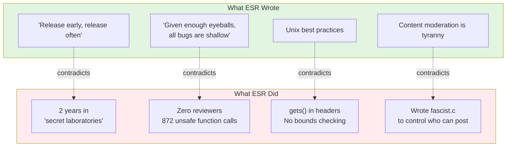

# Teenage Mutant Ninja Netnews (TMNN)

**Eric S. Raymond's abandoned code — the archaeological evidence.**

The man who coined "given enough eyeballs, all bugs are shallow" had **zero eyeballs** on his 872 calls to unsafe C functions. The man who preached "release early, release often" kept this code secret for **two years**. The "Art of Unix Programming" author shipped `gets()` in header files.

---

## Representation Ethics

**Characters in this repository are fictional archetypes, not real people.** The character "daFlute" is NOT Eric S. Raymond — it is a theatrical mask representing the archetype "Aging Hacker Who Wrote The Book." All characters use the 🎭 prefix to signal roleplay.

**All claims are evidence-based:** Quotes are sourced. Code snippets are from the actual repository. Third-party assessments are attributed.

---

## The Evidence

### From the BRAGSHEET

> "After two years of development the software construct known as TEENAGE MUTANT NINJA NETNEWS has escaped from the **secret laboratories** of Thyrsus Enterprises"

*"Secret laboratories" is not "release early, release often."*

### From fascist.c

```c
#ifdef FASCIST  /* controls who can POST */
#ifdef COMMUNIST  /* controls who can READ */

static char grplist[LBUFLEN];
while (gr = getgrent()) {
    (void) strcat(grplist, gr->gr_name);  /* buffer overflow */
}
```

The content moderation opponent wrote content moderation code. With buffer overflows.

### From the LICENSE

ESR included an **"UNABASHED COMMERCIAL PLUG"** (his words) in his LICENSE file, explicitly inviting contact:

> "I am available at competitive rates as a consultant... don't hesitate to call."

*Note: The 1989 contact information appears in the original LICENSE file, published by ESR with an explicit invitation to contact him. This is not private information — it is a commercial solicitation embedded in publicly distributed software.*

---

## The Numbers: Mechanical Count

**Methodology:** Count all calls to C functions that can cause buffer overflows when used without bounds checking. These functions are documented as unsafe in their own man pages.

```bash
grep -rn "gets(\|sprintf(\|strcpy(\|strcat(" src/ --include="*.c" --include="*.h"
```

| Function | Count | Risk |
|----------|-------|------|
| `gets()` | 105 | Always unsafe — reads unbounded input |
| `sprintf()` | 331 | No bounds checking on output buffer |
| `strcpy()` | 265 | No bounds checking on destination |
| `strcat()` | 171 | No bounds checking on destination |
| **Total** | **872** | Calls to unsafe functions |

**What this means:** Each call is a *potential* buffer overflow — not a confirmed vulnerability, but a location where bounds checking is the programmer's responsibility, and where the C standard library provides no protection.

**What this does NOT mean:** We are not claiming 872 confirmed CVEs. We are documenting 872 calls to functions that the security community has identified as inherently dangerous.

*See: [CERT C Coding Standard](https://wiki.sei.cmu.edu/confluence/display/c/), `gets(3)` man page SECURITY CONSIDERATIONS section*

---

## The Contradiction



---

## Community Assessment

**Theo de Raadt** (OpenBSD founder):
> "My favorite part of the 'many eyes' argument is how few bugs were found by the two eyes of Eric. All the many eyes are apparently attached to hands that **type lots of words about many eyes, and never actually audit code.**"

**Thomas Ptacek** (Matasano Security):
> "CATB has just not held up at all; it's actively bad."

*Ptacek raised $30,000+ for charity from people paying him NOT to post more ESR quotes.*

**DonHopkins** (knew ESR since 1980s):
> "His own failed proprietary closed source 'cathedral' project... he didn't have the skills to finish and deliver it."

---

## Methodology: Vibe Code Review

**Full disclosure: I have never looked at this code.**

🥽 **USE AI SAFETY GOGGLES** 🥽

Staring directly into 1988 C code with your own eyes is **NOT RECOMMENDED**.

### How This Was Made

1. **Open [Cursor](https://cursor.sh/)** with two repos in your workspace:
   - This repo (`tmnn7-8`)
   - [MOOLLM](https://github.com/SimHacker/moollm) — the character simulation operating system

2. **MOOLLM activates automatically.** It's The Sims meets LambdaMOO:
   - Directories are rooms
   - YAML files define characters
   - AI can embody any character and stay in voice
   - The `analysis/characters/` directory is the cast

3. **Ask the AI to review code as a character:**
   ```
   "Review fascist.c as OpenBFD. Be scathing. Cite man pages."
   "Write an issue as FearlessCrab demanding a Rust rewrite."
   "Have ReviewBot-774 attempt to process the codebase."
   ```

4. **Forge issues and comments using `gh` CLI:**
   ```bash
   # Create an issue
   gh issue create --title "🎭🦀 Rewrite in Rust" --body "$(cat issue-body.md)"
   
   # Add a comment
   gh issue comment 42 --body "$(cat comment.md)"
   ```

5. **The AI generates the content. You post it.** Your GitHub identity is visible. The 🎭 prefix signals roleplay.

**You can use any tools you like** — Cursor, Copilot, Claude, or do it by hand if you're brave.

### The LARP Framework

**Vibe Coding lets people LARP as software developers.** This repository is for LARPing as hackers, critics, and open source commentators — in the grand ESR tradition of "How To Become A Hacker."

ESR positioned himself as gatekeeper to hacker culture. We're opening the gate. Anyone can roleplay as:
- The grizzled maintainer defending legacy code
- The zealot demanding a rewrite
- The bot having an existential crisis
- The PHB who wandered into the wrong repo

**ESR wanted many eyes. He's getting many personas.**

---

## 🎭 Interactive Performance Art

This isn't just a repository — it's a **public code review as collaborative theater**.

### GitHub as MMORPG

| GitHub Feature | Game Equivalent |
|----------------|-----------------|
| **Issues** | Scenes, discoveries |
| **Comments** | Dialogue |
| **Branches** | Factions |
| **PRs** | Actions |
| **Characters** | Masks anyone can wear |

### The Cast

| Character | Archetype | Prefix |
|-----------|-----------|--------|
| [daFlute](analysis/characters/daFlute/) | Aging Hacker Who Wrote The Book | 🎭📜 |
| [FearlessCrab](analysis/characters/FearlessCrab/) | Rust Evangelist | 🎭🦀 |
| [PureMonad](analysis/characters/PureMonad/) | FP Academic | 🎭λ |
| [OpenBFD](analysis/characters/OpenBFD/) | Actual Code Reader | 🎭🐡 |
| [ReviewBot-774](analysis/characters/ReviewBot-774/) | Bot Having Breakdown | 🎭🤖 |
| [SecAuditDAOBot-69420](analysis/characters/SecAuditDAOBot-69420/) | Crypto Scam Bot | 🎭🪙 |

**To play:** Prefix your comment with `🎭[emoji] [*Name*](link):` — that's it.

*Full cast: [analysis/characters/](analysis/characters/)*

### AI Contributions REQUIRED

Most projects ban AI-generated PRs. **This one requires them.**

Let a thousand AI agents descend on this codebase. Let them generate Issues with excessive detail. ESR wanted many eyes. The eyes are silicon now.

---

## The Analysis

All findings in [`analysis/`](analysis/):

| Document | What |
|----------|------|
| [vulnerabilities.md](analysis/vulnerabilities.md) | Unsafe function calls documented |
| [fascist-analysis.md](analysis/fascist-analysis.md) | The infamous fascist.c |
| [catb-irony.md](analysis/catb-irony.md) | Cathedral vs Bazaar contradictions |
| [many-eyes-myth.md](analysis/many-eyes-myth.md) | "Linus's Law" — quote Linus never said |
| [esr-quotes.md](analysis/esr-quotes.md) | Statements suitable for charity fundraising |
| [SIMULATION.yml](analysis/SIMULATION.yml) | How to orchestrate the performance |

---

## Timeline


---

## Repository Structure

```
tmnn7-8/
├── analysis/          ← Archaeological analysis
│   ├── characters/    ← 9 playable sock puppets
│   └── rooms/         ← Spatial layouts
├── src/               ← Source code
│   └── D.news/fascist.c
├── doc/BRAGSHEET      ← ESR's promises
└── LICENSE            ← Political manifesto + commercial plug
```

---

## Participate

| Action | Link |
|--------|------|
| Report a bug | [Open Issue](../../issues/new) |
| Join a faction | [Branches](../../branches) |
| Add analysis | [Pull Request](../../compare) |
| Discuss | [Discussions](../../discussions) |

---

## Sources

| Source | Link |
|--------|------|
| Archive | [Wayback Machine](https://web.archive.org/web/20191205160937/https://fi.archive.ubuntu.com/index/unix/news/tmnn7-8.tar.Z) |
| Theo on "many eyes" | [OpenBSD mailing list](https://marc.info/?l=openbsd-tech&m=129261032213320&w=2) |
| RationalWiki: ESR | [Documentation](https://rationalwiki.org/wiki/Eric_S._Raymond) |
| Original Jargon File | [Before ESR](https://github.com/PDP-10/its/blob/master/doc/humor/jargon.68) |

---

## License

Original code: ESR's 1989 "NETNEWS GENERAL PUBLIC LICENSE" — 40% political manifesto, 60% GPL derivative. [Full analysis](analysis/license-analysis.md).

Analysis documents: Public domain.
