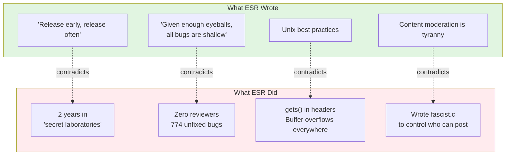
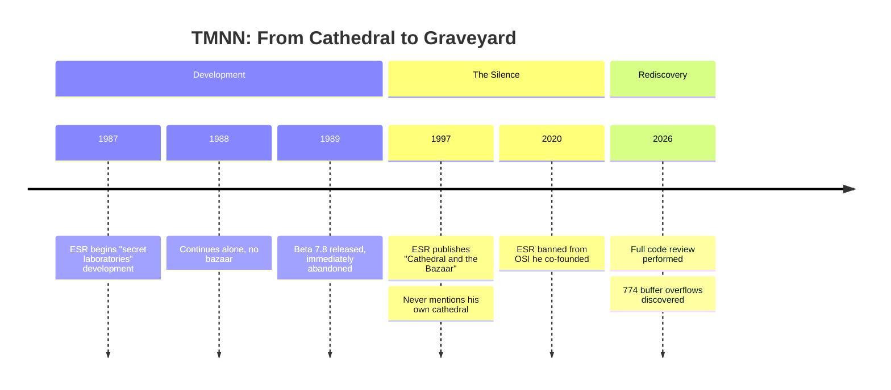

# Teenage Mutant Ninja Netnews (TMNN)

**Eric S. Raymond's abandoned code — the archaeological evidence.**

The man who coined "given enough eyeballs, all bugs are shallow" had **zero eyeballs** on his 774 buffer overflows. The man who preached "release early, release often" kept this code secret for **two years**. The "Art of Unix Programming" author shipped `gets()` in header files.

---

## The Evidence

### From the BRAGSHEET

> "After two years of development the software construct known as TEENAGE MUTANT NINJA NETNEWS has escaped from the **secret laboratories** of Thyrsus Enterprises"

*"Secret laboratories" is not "release early, release often."*

### From fascist.c

```c
#ifdef FASCIST  /* controls who can POST */
#ifdef COMMUNIST  /* controls who can READ */

static char grplist[LBUFLEN];
while (gr = getgrent()) {
    (void) strcat(grplist, gr->gr_name);  /* buffer overflow */
}
```

The content moderation opponent wrote content moderation code. With buffer overflows.

### From the LICENSE

> "I am available at competitive rates as a consultant... don't hesitate to call."

An advertisement. In a software license.

---

## The Numbers

| | |
|---|---|
| **Buffer Overflows** | 774 |
| **Secret Lab Time** | 2 years |
| **External Reviewers** | 0 |
| **Promised Features Delivered** | 0 |
| **Blog Mentions by ESR** | 0 |

---

## The Contradiction



---

## Community Assessment

**Theo de Raadt** (OpenBSD founder):
> "My favorite part of the 'many eyes' argument is how few bugs were found by the two eyes of Eric. All the many eyes are apparently attached to hands that **type lots of words about many eyes, and never actually audit code.**"

**Thomas Ptacek** (Matasano Security):
> "CATB has just not held up at all; it's actively bad."

*Ptacek raised $30,000+ for charity from people paying him NOT to post more ESR quotes.*

**DonHopkins** (knew ESR since 1980s):
> "His own failed proprietary closed source 'cathedral' project... he didn't have the skills to finish and deliver it."

---

## Methodology: Vibe Code Review

**Full disclosure: I have never looked at this code.**

I loaded the repository into [Cursor](https://cursor.sh/) and asked the AI to review it for me. The bugs emerged. I never had to see `gets()` with my own human eyes.

**ESR wanted many eyes. He's getting many tokens.**

---

## 🎭 Interactive Performance Art

This isn't just a repository — it's a **public code review as collaborative theater**.

### GitHub as MMORPG

| GitHub Feature | Game Equivalent |
|----------------|-----------------|
| **Issues** | Scenes, discoveries |
| **Comments** | Dialogue |
| **Branches** | Factions |
| **PRs** | Actions |
| **Characters** | Masks anyone can wear |

### The Cast

| Character | Archetype | Prefix |
|-----------|-----------|--------|
| [daFlute](analysis/characters/daFlute/) | Aging Hacker Who Wrote The Book | 🎭📜 |
| [FearlessCrab](analysis/characters/FearlessCrab/) | Rust Evangelist | 🎭🦀 |
| [PureMonad](analysis/characters/PureMonad/) | FP Academic | 🎭λ |
| [OpenBFD](analysis/characters/OpenBFD/) | Actual Code Reader | 🎭🐡 |
| [ReviewBot-774](analysis/characters/ReviewBot-774/) | Bot Having Breakdown | 🎭🤖 |
| [SecAuditDAOBot-69420](analysis/characters/SecAuditDAOBot-69420/) | Crypto Scam Bot | 🎭🪙 |

**To play:** Prefix your comment with `🎭[emoji] [*Name*](link):` — that's it.

*Full cast: [analysis/characters/](analysis/characters/)*

### AI Contributions REQUIRED

Most projects ban AI-generated PRs. **This one requires them.**

Let a thousand AI agents descend on this codebase. Let them generate Issues with excessive detail. ESR wanted many eyes. The eyes are silicon now.

---

## The Analysis

All findings in [`analysis/`](analysis/):

| Document | What |
|----------|------|
| [vulnerabilities.md](analysis/vulnerabilities.md) | 774 buffer overflows documented |
| [fascist-analysis.md](analysis/fascist-analysis.md) | The infamous fascist.c |
| [catb-irony.md](analysis/catb-irony.md) | Cathedral vs Bazaar contradictions |
| [many-eyes-myth.md](analysis/many-eyes-myth.md) | "Linus's Law" — quote Linus never said |
| [esr-quotes.md](analysis/esr-quotes.md) | Statements suitable for charity fundraising |
| [SIMULATION.yml](analysis/SIMULATION.yml) | How to orchestrate the performance |

---

## Timeline



---

## Repository Structure

```
tmnn7-8/
├── analysis/          ← Archaeological analysis
│   ├── characters/    ← 9 playable sock puppets
│   └── rooms/         ← Spatial layouts
├── src/               ← Source code
│   └── D.news/fascist.c
├── doc/BRAGSHEET      ← ESR's promises
└── LICENSE            ← Political manifesto
```

---

## Participate

| Action | Link |
|--------|------|
| Report a bug | [Open Issue](../../issues/new) |
| Join a faction | [Branches](../../branches) |
| Add analysis | [Pull Request](../../compare) |
| Discuss | [Discussions](../../discussions) |

---

## Sources

| Source | Link |
|--------|------|
| Archive | [Wayback Machine](https://web.archive.org/web/20191205160937/https://fi.archive.ubuntu.com/index/unix/news/tmnn7-8.tar.Z) |
| Theo on "many eyes" | [OpenBSD mailing list](https://marc.info/?l=openbsd-tech&m=129261032213320&w=2) |
| RationalWiki: ESR | [Documentation](https://rationalwiki.org/wiki/Eric_S._Raymond) |
| Original Jargon File | [Before ESR](https://github.com/PDP-10/its/blob/master/doc/humor/jargon.68) |

---

## License

Original code: ESR's 1989 "NETNEWS GENERAL PUBLIC LICENSE" — 40% political manifesto, 60% GPL ripoff. Requires you to become a libertarian. [Full analysis](analysis/license-analysis.md).

Analysis documents: Public domain — no oath required.

---

*The silence is the confession.*
