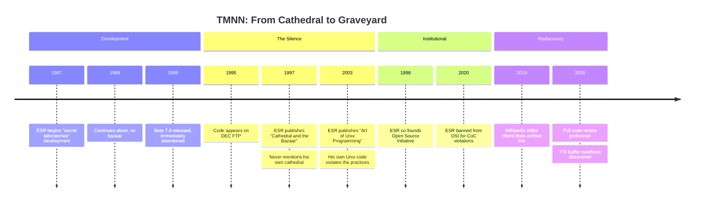
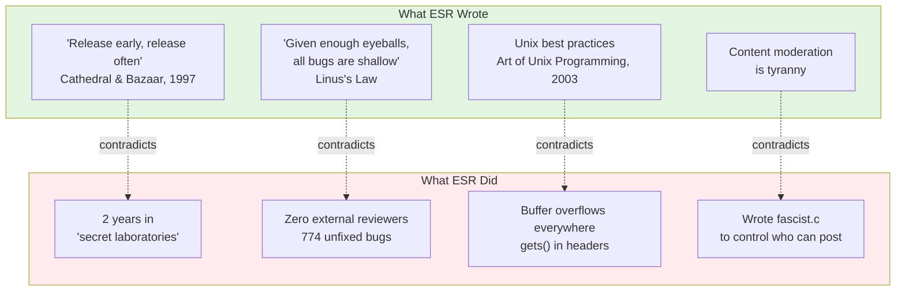
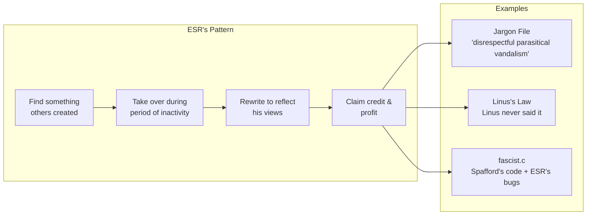

# Teenage Mutant Ninja Netnews (TMNN)

**Eric S. Raymond's abandoned magnum opus — rediscovered after 30 years.**

The man who preached "release early, release often" kept his code secret for two years. The man who coined "given enough eyeballs, all bugs are shallow" had zero eyeballs on his 774 buffer overflows. The "Art of Unix Programming" author wrote code riddled with security disasters.

This repository contains the archaeological evidence.

---

## Quick Facts

| | |
|---|---|
| **Developer** | Eric S. Raymond ("Eric The Flute") |
| **Period** | 1987-1989 |
| **Status** | Abandoned at beta 7.8 |
| **Secret Lab Time** | 2 years |
| **Promised Features Delivered** | 0 |
| **Buffer Overflows** | 774 |
| **Blog Mentions by ESR** | 0 |

---

## The Timeline



---

## Why This Matters

ESR built his entire career on ideas his own code contradicts:



---

## 👁️ Many Eyes: A Community Code Review

**ESR believes in code review. Let's give him some.**

In 2009, ESR audited the [Climatic Research Unit's code](https://esr.ibiblio.org/?p=1447) to "expose" climate scientists. His analysis was [incompetent and politically motivated](https://rationalwiki.org/wiki/Eric_S._Raymond#Global_warming_denialism) — he highlighted *commented-out code* as evidence of fraud, and the scientists were later vindicated.

**Now it's his turn.**

This repository exists so the community can apply ESR's own "many eyes" principle to ESR's own code. The man who wrote "given enough eyeballs, all bugs are shallow" kept his code hidden from eyeballs for decades. 

**No more.**

### 🐛 How to Participate

| Action | Where |
|--------|-------|
| **Report a bug** | [Open an Issue](../../issues) |
| **Document a vulnerability** | [Security tab](../../security) or Issues |
| **Discuss findings** | [Discussions](../../discussions) |
| **Submit analysis** | Pull requests to `analysis/` |

### 📋 What to Look For

- **Buffer overflows** — `sprintf`, `strcpy`, `strcat` without bounds checking
- **Insecure temp files** — `mktemp()` race conditions  
- **Command injection** — `system()`, `popen()` with user input
- **The `gets()` function** — Yes, it's in the headers
- **Hardcoded paths** — `/usr/lib/news`, credentials in source
- **Logic bugs** — Uninitialized variables, missing error handling
- **Style violations** — Against the "Art of Unix Programming" he later wrote

### 🏆 Current Bug Count

| Category | Count | Status |
|----------|-------|--------|
| Buffer overflows | 774 | [Documented](analysis/vulnerabilities.md) |
| `gets()` calls | Multiple | In headers |
| `system()` calls | 15+ | Command injection risks |
| Temp file races | Multiple | `mktemp()` everywhere |
| **Your discovery** | ? | [Open an Issue](../../issues) |

### 💡 The Irony

> "My favorite part of the 'many eyes' argument is how few bugs were found by the two eyes of Eric."
> — Theo de Raadt

ESR claimed code review would find all bugs. His own code had **zero reviewers** and **hundreds of bugs**. Now, finally, the many eyes have arrived.

*Let's see how shallow these bugs really are.*

---

## Repository Structure

```
tmnn7-8/
├── README.md              ← You are here
├── analysis/              ← Archaeological analysis
│   ├── README.md          ← Analysis index & narrative
│   ├── *.yml              ← Source data (YAML Jazz)
│   └── *.md               ← Human narratives
├── doc/                   ← Original documentation
│   └── BRAGSHEET          ← ESR's promises
├── src/                   ← Source code
│   └── D.news/fascist.c   ← Yes, really
├── LICENSE                ← Political manifesto + sales pitch
└── man/                   ← Man pages
```

---

## The Analysis

All findings are documented in [`analysis/`](analysis/):

### The Code

| Document | What It Covers |
|----------|---------------|
| [fascist-analysis.md](analysis/fascist-analysis.md) | The infamous `fascist.c` — FASCIST/COMMUNIST flags, Tolkien cosplay, buffer overflows |
| [bragsheet.md](analysis/bragsheet.md) | ESR's marketing promises vs reality |
| [license-analysis.md](analysis/license-analysis.md) | 40% manifesto, 60% GPL ripoff, 100% ESR |

### The Contradictions

| Document | The Irony |
|----------|-----------|
| [catb-irony.md](analysis/catb-irony.md) | "Release early, release often" said the man who kept code secret for 2 years |
| [many-eyes-myth.md](analysis/many-eyes-myth.md) | "Linus's Law" — the quote Linus never said |
| [ironies.md](analysis/ironies.md) | Complete catalog of ESR contradictions |

### The History

| Document | What Happened |
|----------|--------------|
| [osi-ban.md](analysis/osi-ban.md) | Banned from the organization he co-founded |
| [jargon-file.md](analysis/jargon-file.md) | How he hijacked hacker culture |
| [sex-tips-honeytrap.md](analysis/sex-tips-honeytrap.md) | From pickup artist to honeytrap conspiracy |

### The Receipts

| Document | The Evidence |
|----------|-------------|
| [esr-quotes.md](analysis/esr-quotes.md) | Documented statements suitable for charity fundraising |
| [analysis/INDEX.yml](analysis/INDEX.yml) | Master index of all source data |

---

## Key Evidence

### From the BRAGSHEET

> "After two years of development the software construct known as TEENAGE MUTANT NINJA NETNEWS has escaped from the secret laboratories of Thyrsus Enterprises"

*"Secret laboratories" is not "release early, release often."*

### From fascist.c

```c
#ifdef FASCIST  /* controls who can POST */
#ifdef COMMUNIST  /* controls who can READ */

static char grplist[LBUFLEN];
while (gr = getgrent()) {
    (void) strcat(grplist, gr->gr_name);  /* buffer overflow */
}
```

*The content moderation opponent wrote content moderation code. And added buffer overflows.*

### From the LICENSE

> "I am available at competitive rates as a consultant... don't hesitate to call."

*An advertisement in a software license. Stay classy.*

---

## Community Assessment

**Theo de Raadt** (OpenBSD founder):
> "My favorite part of the 'many eyes' argument is how few bugs were found by the two eyes of Eric."

**Thomas Ptacek** (Matasano Security):
> "CATB has just not held up at all; it's actively bad."

*Ptacek raised $30,000+ for charity from people paying him NOT to post more ESR quotes.*

**DonHopkins** (knew ESR since early 1980s):
> "His own failed proprietary closed source 'cathedral' project... he didn't have the skills to finish and deliver it."

---

## The Pattern



---

## Archive Sources

| Source | Status |
|--------|--------|
| `ftp.digital.com/pub/news/tmnn/` | Offline (DEC FTP) |
| [fi.archive.ubuntu.com](https://web.archive.org/web/20191205160937/https://fi.archive.ubuntu.com/index/unix/news/tmnn7-8.tar.Z) | Archived via Wayback |
| [Wikipedia: B News](https://en.wikipedia.org/wiki/B_News) | Documents TMNN |

---

## See Also

- [Original Jargon File](https://github.com/PDP-10/its/blob/master/doc/humor/jargon.68) — Free of ESR's edits
- [Theo on "many eyes"](https://marc.info/?l=openbsd-tech&m=129261032213320&w=2) — OpenBSD founder's critique
- [RationalWiki: ESR](https://rationalwiki.org/wiki/Eric_S._Raymond) — Comprehensive documentation

---

## ⚖️ LICENSE COMPLIANCE NOTICE

**IMPORTANT:** By using, viewing, or thinking about this code, you are bound by ESR's 1989 **NETNEWS GENERAL PUBLIC LICENSE**.

We **STRONGLY ADMONISH** all users to carefully read and comply with the following legally binding terms:

### You Must Agree To:

1. **Support strict intellectual property laws** and the right of designers to hold software proprietary
   
   > *Yes, the future "open source" guy put this in his license.*

2. **Guide your use by respect for personal, political, and economic freedom; by support for natural property and contract rights**
   
   > *A software license that requires you to become a libertarian.*

3. **Oppose unconditionally every form of and rationalization for censorship**
   
   > *Says the man who wrote `fascist.c` to control who could post.*

4. **Affirm the autonomy and privacy of individuals and voluntary associations**
   
   > *Read: agree with ESR's politics or you're violating the license.*

5. **NOT construe this action as endorsement of the FSF or Richard Stallman**
   
   > *He literally put an anti-RMS clause in his license. In 1988.*

6. **Acknowledge that the "nuisance message" requirement has been removed**
   
   > *ESR's term for "giving credit to the original authors."*

### You Are Also Invited To:

7. **Call ESR for consulting work** at his 1989 phone number: `(215)-296-5718`
   
   > *Yes, there's an "UNABASHED COMMERCIAL PLUG" section. In a software license.*

8. **Visit his "secret laboratories"** at 22 South Warren Avenue, Malvern PA 19355
   
   > *The address of the secret laboratories. Not so secret.*

**Read the full license:** [LICENSE](LICENSE) | **Analysis:** [license-analysis.md](analysis/license-analysis.md)

*It's 40% political manifesto, 60% GPL ripoff, and 100% ESR.*

---

## License (For Real)

Original TMNN code: ESR's 1989 "NETNEWS GENERAL PUBLIC LICENSE" (see above)

Analysis documents: Public domain — no libertarian oath required

---

*The silence is the confession.*
