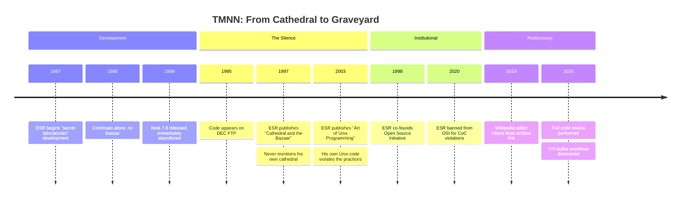
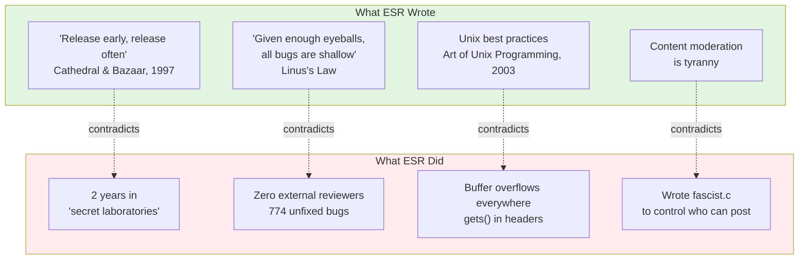
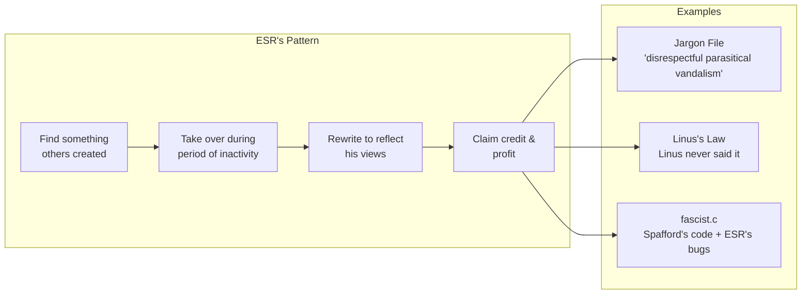

# Teenage Mutant Ninja Netnews (TMNN)

**Eric S. Raymond's abandoned magnum opus — rediscovered after 30 years.**

The man who preached "release early, release often" kept his code secret for two years. The man who coined "given enough eyeballs, all bugs are shallow" had zero eyeballs on his 774 buffer overflows. The "Art of Unix Programming" author wrote code riddled with security disasters.

This repository contains the archaeological evidence.

---

## Quick Facts

| | |
|---|---|
| **Developer** | Eric S. Raymond ("Eric The Flute") |
| **Period** | 1987-1989 |
| **Status** | Abandoned at beta 7.8 |
| **Secret Lab Time** | 2 years |
| **Promised Features Delivered** | 0 |
| **Buffer Overflows** | 774 |
| **Blog Mentions by ESR** | 0 |

---

## The Timeline



---

## Why This Matters

ESR built his entire career on ideas his own code contradicts:



---

## Repository Structure

```
tmnn7-8/
├── README.md              ← You are here
├── analysis/              ← Archaeological analysis
│   ├── README.md          ← Analysis index & narrative
│   ├── *.yml              ← Source data (YAML Jazz)
│   └── *.md               ← Human narratives
├── doc/                   ← Original documentation
│   └── BRAGSHEET          ← ESR's promises
├── src/                   ← Source code
│   └── D.news/fascist.c   ← Yes, really
├── LICENSE                ← Political manifesto + sales pitch
└── man/                   ← Man pages
```

---

## The Analysis

All findings are documented in [`analysis/`](analysis/):

### The Code

| Document | What It Covers |
|----------|---------------|
| [FASCIST.md](analysis/FASCIST.md) | The infamous `fascist.c` — FASCIST/COMMUNIST flags, Tolkien cosplay, buffer overflows |
| [BRAGSHEET.md](analysis/BRAGSHEET.md) | ESR's marketing promises vs reality |
| [LICENSE.md](analysis/LICENSE.md) | 40% manifesto, 60% GPL ripoff, 100% ESR |

### The Contradictions

| Document | The Irony |
|----------|-----------|
| [CATB-IRONY.md](analysis/CATB-IRONY.md) | "Release early, release often" said the man who kept code secret for 2 years |
| [MANY-EYES.md](analysis/MANY-EYES.md) | "Linus's Law" — the quote Linus never said |
| [IRONIES.md](analysis/IRONIES.md) | Complete catalog of ESR contradictions |

### The History

| Document | What Happened |
|----------|--------------|
| [OSI-BAN.md](analysis/OSI-BAN.md) | Banned from the organization he co-founded |
| [JARGON-FILE.md](analysis/JARGON-FILE.md) | How he hijacked hacker culture |
| [SEX-TIPS.md](analysis/SEX-TIPS.md) | From pickup artist to honeytrap conspiracy |

### The Receipts

| Document | The Evidence |
|----------|-------------|
| [ESR-QUOTES.md](analysis/ESR-QUOTES.md) | Documented statements suitable for charity fundraising |
| [analysis/INDEX.yml](analysis/INDEX.yml) | Master index of all source data |

---

## Key Evidence

### From the BRAGSHEET

> "After two years of development the software construct known as TEENAGE MUTANT NINJA NETNEWS has escaped from the secret laboratories of Thyrsus Enterprises"

*"Secret laboratories" is not "release early, release often."*

### From fascist.c

```c
#ifdef FASCIST  /* controls who can POST */
#ifdef COMMUNIST  /* controls who can READ */

static char grplist[LBUFLEN];
while (gr = getgrent()) {
    (void) strcat(grplist, gr->gr_name);  /* buffer overflow */
}
```

*The content moderation opponent wrote content moderation code. And added buffer overflows.*

### From the LICENSE

> "I am available at competitive rates as a consultant... don't hesitate to call."

*An advertisement in a software license. Stay classy.*

---

## Community Assessment

**Theo de Raadt** (OpenBSD founder):
> "My favorite part of the 'many eyes' argument is how few bugs were found by the two eyes of Eric."

**Thomas Ptacek** (Matasano Security):
> "CATB has just not held up at all; it's actively bad."

*Ptacek raised $30,000+ for charity from people paying him NOT to post more ESR quotes.*

**DonHopkins** (knew ESR since early 1980s):
> "His own failed proprietary closed source 'cathedral' project... he didn't have the skills to finish and deliver it."

---

## The Pattern



---

## Archive Sources

| Source | Status |
|--------|--------|
| `ftp.digital.com/pub/news/tmnn/` | Offline (DEC FTP) |
| [fi.archive.ubuntu.com](https://web.archive.org/web/20191205160937/https://fi.archive.ubuntu.com/index/unix/news/tmnn7-8.tar.Z) | Archived via Wayback |
| [Wikipedia: B News](https://en.wikipedia.org/wiki/B_News) | Documents TMNN |

---

## See Also

- [Original Jargon File](https://github.com/PDP-10/its/blob/master/doc/humor/jargon.68) — Free of ESR's edits
- [Theo on "many eyes"](https://marc.info/?l=openbsd-tech&m=129261032213320&w=2) — OpenBSD founder's critique
- [RationalWiki: ESR](https://rationalwiki.org/wiki/Eric_S._Raymond) — Comprehensive documentation

---

## License

Original TMNN code: ESR's 1989 "NETNEWS GENERAL PUBLIC LICENSE"

Analysis documents: Public domain

---

*The silence is the confession.*
