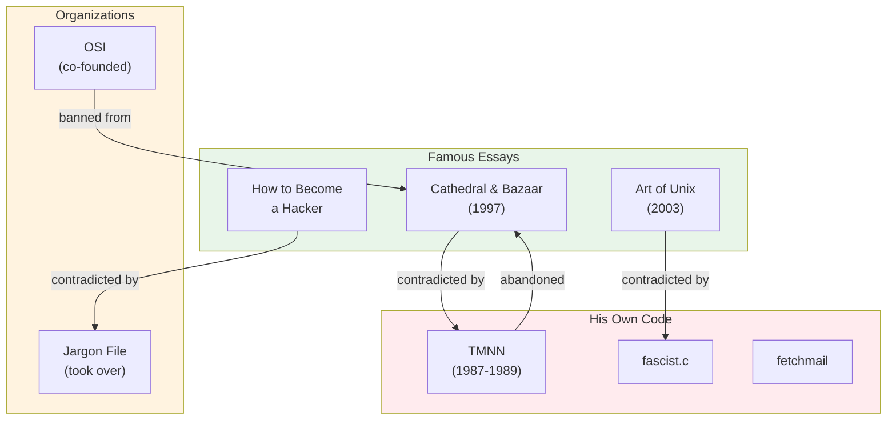
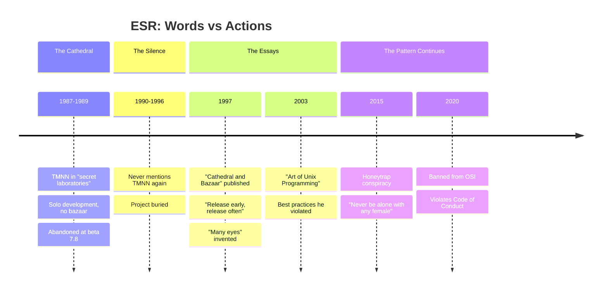

# The Ironies of Eric S. Raymond

A catalog of contradictions between ESR's famous writings and his actual practices.

**Source data:** [catb-irony.yml](catb-irony.yml) | [many-eyes-myth.yml](many-eyes-myth.yml) | [art-of-unix-irony.yml](art-of-unix-irony.yml) | [content-moderation-irony.yml](content-moderation-irony.yml)

---

## The Map



---

## The Cathedral and the Bazaar

*Full analysis: [CATB-IRONY.md](CATB-IRONY.md)*

| He Wrote (1997) | He Did (1987-1989) |
|----------|--------|
| "Release early. Release often." | Kept TMNN in "secret laboratories" for 2 years |
| "Given enough eyeballs, all bugs are shallow." | TMNN had 774+ buffer overflows — zero reviewers |
| "The bazaar model works better" | Developed TMNN alone in cathedral style |

**Theo de Raadt** on "many eyes" ([source](https://marc.info/?l=openbsd-tech&m=129261032213320&w=2)):

> "My favorite part of the 'many eyes' argument is how few bugs were found by the two eyes of Eric (the originator of the statement)."

*See also: [MANY-EYES.md](MANY-EYES.md) — The quote Linus never said.*

---

## The Art of Unix Programming

*Full analysis: [art-of-unix-irony.yml](art-of-unix-irony.yml)*

| He Wrote (2003) | His Code (1989) |
|----------|--------|
| "Distrust all input" | 61 command injections via unsanitized input |
| "Use safe library functions" | 774 unsafe string functions, `gets()` in [`system.h`](../src/include/system.h) |
| "Handle errors gracefully" | "This routine is a HOG!!!!!" — no error handling |

**Evidence:** [`src/D.news/fascist.c`](../src/D.news/fascist.c) line 117

*See also: [FASCIST.md](FASCIST.md) — The full breakdown.*

---

## Open Source Advocacy

| He Preached | He Practiced |
|-------------|--------------|
| Open collaboration | Banned from OSI — *which he co-founded* — in 2020 |
| Community-driven development | Distanced himself from FSF in 1989 [`LICENSE`](../LICENSE) |
| "How to Become a Hacker" | Hijacked the Jargon File; criticized by actual MIT hackers |

*See also: [OSI-BAN.md](OSI-BAN.md) | [JARGON-FILE.md](JARGON-FILE.md)*

---

## Content Moderation

*Full analysis: [content-moderation-irony.yml](content-moderation-irony.yml)*

| He Built (1989) | He Argued (2015+) |
|----------|-----------|
| `fascist.c` — code to control who can post/read | Content moderation is tyranny |
| `nasty_t` struct for "miscreant" user restrictions | Codes of conduct are oppression |
| Site banning for "evil" sites like "mordor" | Open source should have no restrictions |

**The code:**

```c
#ifdef FASCIST   /* controls who can POST */
#ifdef COMMUNIST /* controls who can READ */

nasty_t *fascist(user)  /* yes, this is the function name */
```

*See also: [FASCIST.md](FASCIST.md)*

---

## "Linus's Law"

*Full analysis: [MANY-EYES.md](MANY-EYES.md)*

| The Claim | The Reality |
|-----------|-------------|
| Named it "Linus's Law" | Linus Torvalds never said it |
| Attributed to Torvalds | ESR invented it himself |
| Borrowed credibility | Avoided accountability when proven false |

**DonHopkins:**

> "He made up the ridiculous 'many eyes' quote himself, then misnamed it 'Linus's Law' to avoid personal responsibility and shift the blame to innocent Linus Torvalds, who never said such a stupid thing."

---

## Sex and Gender

*Full analysis: [SEX-TIPS.md](SEX-TIPS.md)*

| "Sex Tips for Geeks" (early 2000s) | "Honeytrap" Warning (2015) |
|----------|---------|
| "Trust me, women will fall all over themselves" | "Never be alone with any female at a conference" |
| "Emit fitness-to-reproduce signals" | Women at conferences are dangerous honeytrap agents |
| Pickup advice based on "evolutionary psychology" | Feminist activists are framing male developers |

**DonHopkins:**

> "His infamous 'Sex Tips for Geeks' essay comes off like it was written by Pepé Le Pew."

---

## Resume vs Reality

*Full analysis: [esr-resume-analysis.yml](esr-resume-analysis.yml)*

| [Resume](http://catb.org/~esr/resume.html) Says | Reality Was |
|-------------|-------------|
| "A rewrite of the USENET netnews software" | "Teenage Mutant Ninja Netnews" — abandoned at beta 7.8 |
| 7 words for TMNN | ∞ hours droning about it at SF conventions |
| 47 words for martial arts | More resume space for fighting than his biggest project |
| No mention of outcome | Wikipedia: "the project was abandoned shortly thereafter" |

---

## The Timeline of Irony



---

## The Pattern

ESR consistently:

1. **Takes credit for ideas he didn't originate**
   - "Linus's Law" — Linus never said it
   - Jargon File — rewrote community document

2. **Writes about how things should work while doing the opposite**
   - "Release early" after 2 years in secret labs
   - Unix best practices with 774 buffer overflows

3. **Claims authority over communities that eventually reject him**
   - Co-founded OSI → banned from OSI
   - Took over Jargon File → criticized by original hackers

4. **Embeds political ideology into technical spaces**
   - FASCIST/COMMUNIST compile flags
   - Libertarian manifesto in LICENSE file
   - Jargon File rewrites

5. **Projects himself as a righteous wizard fighting evil**
   - Tolkien cosplay in `fascist.c`
   - "Gandalf" and "Radagast" in good group
   - "Mordor" and "Orthanc" as evil sites

---

The TMNN source code, dormant for 30+ years, provides the archaeological evidence.

*See also: [FASCIST.md](FASCIST.md) | [BRAGSHEET.md](BRAGSHEET.md) | [LICENSE.md](LICENSE.md)*

---

**Source data:** [catb-irony.yml](catb-irony.yml) | [fascist-analysis.yml](fascist-analysis.yml) | [esr-resume-analysis.yml](esr-resume-analysis.yml)

*← Back to [README](README.md)*
