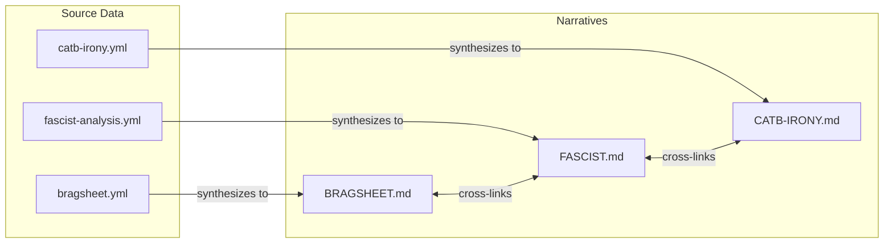
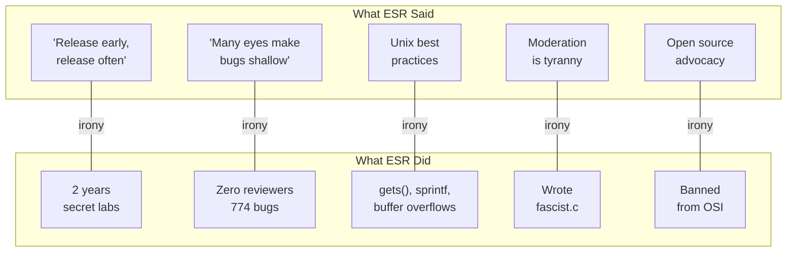

# Analysis: The Archaeological Record

This directory contains the structured evidence of ESR's TMNN project and its contradictions with his later career.

---

## How This Works

**YAML Jazz files (`.yml`)** are the annotated source data — structured facts with semantic commentary in comments. They are the archaeological record.

**Markdown files (`.md`)** are human narratives synthesized from the YAML sources. Every claim in an `.md` file is supported by data in a `.yml` file.

---

## Quick Navigation

| Want to... | Start here |
|-----------|-----------|
| Understand the code | [FASCIST.md](#the-code) |
| See the contradictions | [IRONIES.md](#the-ironies) |
| Read the quotes | [ESR-QUOTES.md](#the-receipts) |
| Get the full picture | [Keep reading](#the-narrative) |

---

## The Narrative

### Act I: The Cathedral

ESR spent 1987-1989 building TMNN in "secret laboratories" — his apartment in Malvern, PA. He called himself the "mad mastermind of TMN-Netnews" and spent endless hours at SF conventions cornering people to brag about it.

**Start here:** [BRAGSHEET.md](BRAGSHEET.md) — The promises. Hypertext, encryption, AI filtering. All vaporware.

**Then:** [LICENSE.md](LICENSE.md) — A software license that's 40% libertarian manifesto, including an actual advertisement for his consulting services.

**Key evidence:**
- [`doc/BRAGSHEET`](../doc/BRAGSHEET) — Original marketing document
- [`LICENSE`](../LICENSE) — The political manifesto
- [bragsheet.yml](bragsheet.yml) — Annotated analysis
- [license-analysis.yml](license-analysis.yml) — Line-by-line breakdown

### Act II: The Code

The code itself tells the story. 23,549 lines of C with 774 buffer overflows, a file literally named `fascist.c`, and comments like "This routine is a HOG!!!!!"

**Start here:** [FASCIST.md](FASCIST.md) — ESR took Eugene Spafford's security code and added political flags, Tolkien cosplay, and vulnerabilities.

**Key evidence:**
- [`src/D.news/fascist.c`](../src/D.news/fascist.c) — The infamous file
- [`src/D.priv/lock.c`](../src/D.priv/lock.c) — Self-described "ugly and flaky"
- [fascist-analysis.yml](fascist-analysis.yml) — Deep dive
- [vulnerabilities.yml](vulnerabilities.yml) — Full catalog
- [code-index.yml](code-index.yml) — File-by-file risk assessment

### Act III: The Silence

Then it was abandoned. Beta level 7.8. None of the promised features delivered. ESR never mentioned it again.

**Key evidence:**
- [esr-silence.yml](esr-silence.yml) — Zero blog mentions despite prolific writing
- [esr-resume-analysis.yml](esr-resume-analysis.yml) — How he sanitizes it to 7 words
- [timeline.yml](timeline.yml) — The full chronology

### Act IV: The Bazaar

Eight years later, ESR became famous writing "The Cathedral and the Bazaar" — preaching everything his TMNN code contradicted.

**Start here:** [CATB-IRONY.md](CATB-IRONY.md) — "Release early, release often" from the man who kept code secret for 2 years.

**Then:** [MANY-EYES.md](MANY-EYES.md) — "Linus's Law" is a quote Linus never said, used to avoid accountability.

**Full catalog:** [IRONIES.md](IRONIES.md) — Every contradiction mapped.

**Key evidence:**
- [catb-irony.yml](catb-irony.yml) — Point-by-point analysis
- [many-eyes-myth.yml](many-eyes-myth.yml) — The myth deconstructed
- [art-of-unix-irony.yml](art-of-unix-irony.yml) — Unix best practices vs his code
- [content-moderation-irony.yml](content-moderation-irony.yml) — fascist.c vs "moderation is tyranny"

### Act V: The Pattern

TMNN isn't an outlier. It's the pattern.

**The Jargon File:** [JARGON-FILE.md](JARGON-FILE.md) — He took over a community document and rewrote it to spread his ideology.

**The OSI:** [OSI-BAN.md](OSI-BAN.md) — Banned from the organization he co-founded.

**The Rest:** [SEX-TIPS.md](SEX-TIPS.md) — From "Sex Tips for Geeks" to honeytrap conspiracy theories.

**Key evidence:**
- [jargon-file.yml](jargon-file.yml) — The hijacking
- [osi-ban.yml](osi-ban.yml) — The expulsion
- [sex-tips-honeytrap.yml](sex-tips-honeytrap.yml) — The spiral
- [fetchmail.yml](fetchmail.yml) — Another security-challenged project
- [sf-con-behavior.yml](sf-con-behavior.yml) — The droning

---

## The Ironies

A visual map of contradictions:

**Full analysis:** [IRONIES.md](IRONIES.md)

---

## The Receipts

### First-Hand Testimony

**DonHopkins** knew ESR since the early 1980s and witnessed the TMNN era:

> "His own failed proprietary closed source 'cathedral' project, that he was notorious for insufferably and arrogantly bragging about during the 80's, but never releasing, and finally giving up on because he didn't have the skills to finish and deliver it."

**Full testimony:** [donhopkins-testimony.yml](donhopkins-testimony.yml)

### Expert Assessment

**Theo de Raadt** (OpenBSD founder):

> "All the many eyes are apparently attached to a lot of hands that type lots of words about many eyes, and never actually audit code."

**Thomas Ptacek** (Matasano Security):

> "CATB has just not held up at all; it's actively bad."

### The Quote Collection

**For charity fundraising:** [ESR-QUOTES.md](ESR-QUOTES.md) — Documented statements on race, Islam, LGBTQ+ people, and women.

*Ptacek raised $30,000+ from people paying him NOT to post more ESR quotes.*

**Source data:**
- [esr-quotes.yml](esr-quotes.yml) — Charity-ready quotes
- [esr-receipts.yml](esr-receipts.yml) — Full HN/community receipts
- [receipts.yml](receipts.yml) — Additional citations

---

## File Index

### Narratives (.md)

| File | Summary |
|------|---------|
| [ANALYSIS.md](ANALYSIS.md) | Legacy summary (see this README) |
| [BRAGSHEET.md](BRAGSHEET.md) | ESR's promises vs reality |
| [CATB-IRONY.md](CATB-IRONY.md) | Cathedral and Bazaar contradictions |
| [ESR-QUOTES.md](ESR-QUOTES.md) | Charity fundraising quote collection |
| [FASCIST.md](FASCIST.md) | Deep dive into fascist.c |
| [IRONIES.md](IRONIES.md) | Complete contradiction catalog |
| [JARGON-FILE.md](JARGON-FILE.md) | Jargon File hijacking |
| [LICENSE.md](LICENSE.md) | Political manifesto analysis |
| [MANY-EYES.md](MANY-EYES.md) | "Linus's Law" debunking |
| [OSI-BAN.md](OSI-BAN.md) | Banned from his own organization |
| [SEX-TIPS.md](SEX-TIPS.md) | Sex tips to honeytrap conspiracy |

### Source Data (.yml)

| File | Contents |
|------|----------|
| [INDEX.yml](INDEX.yml) | Master index of all analysis files |
| [art-of-unix-irony.yml](art-of-unix-irony.yml) | Unix book vs his Unix code |
| [bragsheet.yml](bragsheet.yml) | BRAGSHEET promises annotated |
| [by-the-numbers.yml](by-the-numbers.yml) | Harper's Index statistics |
| [catb-irony.yml](catb-irony.yml) | CatB contradictions |
| [code-index.yml](code-index.yml) | File-by-file risk assessment |
| [code-review.yml](code-review.yml) | Original review findings |
| [content-moderation-irony.yml](content-moderation-irony.yml) | fascist.c vs moderation stance |
| [donhopkins-testimony.yml](donhopkins-testimony.yml) | First-hand testimony |
| [esr-quotes.yml](esr-quotes.yml) | Charity-ready quotes |
| [esr-receipts.yml](esr-receipts.yml) | HN/community receipts |
| [esr-resume-analysis.yml](esr-resume-analysis.yml) | Resume sanitization |
| [esr-silence.yml](esr-silence.yml) | The deliberate erasure |
| [fascist-analysis.yml](fascist-analysis.yml) | fascist.c deep dive |
| [fetchmail.yml](fetchmail.yml) | Another insecure project |
| [jargon-file.yml](jargon-file.yml) | Jargon File hijacking |
| [license-analysis.yml](license-analysis.yml) | LICENSE breakdown |
| [many-eyes-myth.yml](many-eyes-myth.yml) | Linus's Law debunking |
| [osi-ban.yml](osi-ban.yml) | OSI expulsion |
| [receipts.yml](receipts.yml) | Community quotes |
| [sex-tips-honeytrap.yml](sex-tips-honeytrap.yml) | Sex tips & honeytrap |
| [sf-con-behavior.yml](sf-con-behavior.yml) | SF con droning |
| [timeline.yml](timeline.yml) | Full chronology |
| [vulnerabilities.yml](vulnerabilities.yml) | Security catalog |

### Other

| File | Contents |
|------|----------|
| [hn-post.txt](hn-post.txt) | Original Hacker News post |

---

## By The Numbers

| Metric | Value | Source |
|--------|-------|--------|
| Years in "secret laboratories" | 2 | [bragsheet.yml](bragsheet.yml) |
| Beta level at abandonment | 7.8 | [`src/version.h`](../src/version.h) |
| Promised features delivered | 0 | [bragsheet.yml](bragsheet.yml) |
| Buffer overflows | 774 | [vulnerabilities.yml](vulnerabilities.yml) |
| mktemp() race conditions | 42 | [vulnerabilities.yml](vulnerabilities.yml) |
| Command injections | 61 | [vulnerabilities.yml](vulnerabilities.yml) |
| Blog mentions by ESR | 0 | [esr-silence.yml](esr-silence.yml) |
| Resume words for TMNN | 7 | [esr-resume-analysis.yml](esr-resume-analysis.yml) |
| Resume words for martial arts | 47 | [esr-resume-analysis.yml](esr-resume-analysis.yml) |
| Charity raised from ESR quotes | $30,000+ | [receipts.yml](receipts.yml) |

**Full statistics:** [by-the-numbers.yml](by-the-numbers.yml)

---

*The real cathedral was the ego we built along the way.*
