# TMNN Analysis

**The archaeological record of ESR's contradictions.**

---

## The Big Picture

---

## Quick Navigation

| I want to... | Start here |
|-------------|------------|
| Understand what happened | [TIMELINE.md](TIMELINE.md) |
| See the code disasters | [FASCIST.md](FASCIST.md) |
| Count the vulnerabilities | [VULNERABILITIES.md](VULNERABILITIES.md) |
| Read the contradictions | [IRONIES.md](IRONIES.md) |
| See first-hand testimony | [TESTIMONY.md](TESTIMONY.md) |
| Get the receipts | [ESR-QUOTES.md](ESR-QUOTES.md) |
| Just show me numbers | [BY-THE-NUMBERS.md](BY-THE-NUMBERS.md) |

---

## The Story

### Act I: The Cathedral

ESR built TMNN alone in "secret laboratories" for two years, bragging about it at every SF convention while never releasing it.

📖 [BRAGSHEET.md](BRAGSHEET.md) — The promises  
📖 [LICENSE.md](LICENSE.md) — The political manifesto

### Act II: The Code

The code tells the story: 774 buffer overflows, FASCIST/COMMUNIST compile flags, "This routine is a HOG!!!!!"

📖 [FASCIST.md](FASCIST.md) — The infamous file  
📖 [VULNERABILITIES.md](VULNERABILITIES.md) — Full catalog

### Act III: The Silence

ESR never mentioned TMNN again. Zero blog posts. Seven words on his resume.

📖 [RESUME.md](RESUME.md) — The erasure

### Act IV: The Essays

Eight years later, ESR became famous preaching everything his code contradicted.

📖 [CATB-IRONY.md](CATB-IRONY.md) — "Release early, release often"  
📖 [MANY-EYES.md](MANY-EYES.md) — The quote Linus never said

### Act V: The Pattern

TMNN isn't the exception. It's the pattern.

```mermaid
flowchart TB
    subgraph pattern["ESR's Career Pattern"]
        find["Find others' work"]
        take["Take over"]
        rewrite["Inject ideology"]
        claim["Claim credit"]
        rejected["Get rejected"]
    end
    
    find --> take --> rewrite --> claim --> rejected
    
    subgraph examples["Examples"]
        jargon["Jargon File<br/>'parasitical vandalism'"]
        linus["'Linus's Law'<br/>Linus never said it"]
        spaf["Spafford's code<br/>+ ESR's bugs"]
        osi["OSI<br/>co-founded → banned"]
    end
    
    claim --> jargon
    claim --> linus
    claim --> spaf
    rejected --> osi
```

📖 [JARGON-FILE.md](JARGON-FILE.md) — The hijacking  
📖 [OSI-BAN.md](OSI-BAN.md) — Banned from his own org  
📖 [SEX-TIPS.md](SEX-TIPS.md) — The later years

---

## The Evidence

### The Code

| Document | What It Shows |
|----------|---------------|
| [FASCIST.md](FASCIST.md) | The infamous `fascist.c` — FASCIST/COMMUNIST flags, Tolkien cosplay, "HOG!!!!!" |
| [VULNERABILITIES.md](VULNERABILITIES.md) | 774 buffer overflows, 61 injections, 42 race conditions |
| [BRAGSHEET.md](BRAGSHEET.md) | Marketing promises vs zero delivery |
| [LICENSE.md](LICENSE.md) | Political manifesto + consulting advertisement |

### The Contradictions

| Document | The Irony |
|----------|-----------|
| [IRONIES.md](IRONIES.md) | **Complete catalog of contradictions** |
| [CATB-IRONY.md](CATB-IRONY.md) | "Release early" after 2 years in secret |
| [MANY-EYES.md](MANY-EYES.md) | "Linus's Law" — Linus never said it |

### The History

| Document | What Happened |
|----------|---------------|
| [TIMELINE.md](TIMELINE.md) | **Full 37-year chronology** |
| [RESUME.md](RESUME.md) | How he buries TMNN |
| [OSI-BAN.md](OSI-BAN.md) | Banned from OSI he co-founded |
| [JARGON-FILE.md](JARGON-FILE.md) | "Disrespectful parasitical vandalism" |
| [SEX-TIPS.md](SEX-TIPS.md) | Sex tips to honeytrap conspiracy |

### The Receipts

| Document | The Evidence |
|----------|--------------|
| [TESTIMONY.md](TESTIMONY.md) | **First-hand witness accounts** |
| [ESR-QUOTES.md](ESR-QUOTES.md) | Quotes for charity fundraising |
| [BY-THE-NUMBERS.md](BY-THE-NUMBERS.md) | Harper's Index statistics |

---

## By The Numbers

| Metric | Value | Details |
|--------|-------|---------|
| Years in secret labs | **2** | [TIMELINE.md](TIMELINE.md) |
| Beta level at abandonment | **7.8** | [BRAGSHEET.md](BRAGSHEET.md) |
| Features delivered | **0** | [BRAGSHEET.md](BRAGSHEET.md) |
| Buffer overflows | **774** | [VULNERABILITIES.md](VULNERABILITIES.md) |
| Command injections | **61** | [VULNERABILITIES.md](VULNERABILITIES.md) |
| Race conditions | **42** | [VULNERABILITIES.md](VULNERABILITIES.md) |
| Resume words for TMNN | **7** | [RESUME.md](RESUME.md) |
| Resume words for martial arts | **47** | [RESUME.md](RESUME.md) |
| Blog mentions by ESR | **0** | [RESUME.md](RESUME.md) |
| Years code buried | **30** | [TIMELINE.md](TIMELINE.md) |
| Charity raised from ESR quotes | **$30,000+** | [ESR-QUOTES.md](ESR-QUOTES.md) |

---

## The Community's Verdict

> "My favorite part of the 'many eyes' argument is how few bugs were found by the two eyes of Eric."  
> — **Theo de Raadt**, OpenBSD founder

> "CATB has just not held up at all; it's actively bad."  
> — **Thomas Ptacek**, Matasano Security

> "His own failed proprietary closed source 'cathedral' project... he didn't have the skills to finish and deliver it."  
> — **DonHopkins**, knew ESR since early 1980s

*See: [TESTIMONY.md](TESTIMONY.md)*

---

## Source Data

For those who want the raw annotated data, the YAML Jazz source files are available:

YAML source files (click to expand)

| Source File | Corresponding Narrative |
|-------------|------------------------|
| [timeline.yml](timeline.yml) | [TIMELINE.md](TIMELINE.md) |
| [vulnerabilities.yml](vulnerabilities.yml) | [VULNERABILITIES.md](VULNERABILITIES.md) |
| [fascist-analysis.yml](fascist-analysis.yml) | [FASCIST.md](FASCIST.md) |
| [bragsheet.yml](bragsheet.yml) | [BRAGSHEET.md](BRAGSHEET.md) |
| [license-analysis.yml](license-analysis.yml) | [LICENSE.md](LICENSE.md) |
| [catb-irony.yml](catb-irony.yml) | [CATB-IRONY.md](CATB-IRONY.md) |
| [many-eyes-myth.yml](many-eyes-myth.yml) | [MANY-EYES.md](MANY-EYES.md) |
| [jargon-file.yml](jargon-file.yml) | [JARGON-FILE.md](JARGON-FILE.md) |
| [osi-ban.yml](osi-ban.yml) | [OSI-BAN.md](OSI-BAN.md) |
| [sex-tips-honeytrap.yml](sex-tips-honeytrap.yml) | [SEX-TIPS.md](SEX-TIPS.md) |
| [esr-resume-analysis.yml](esr-resume-analysis.yml) | [RESUME.md](RESUME.md) |
| [esr-silence.yml](esr-silence.yml) | [RESUME.md](RESUME.md) |
| [donhopkins-testimony.yml](donhopkins-testimony.yml) | [TESTIMONY.md](TESTIMONY.md) |
| [esr-quotes.yml](esr-quotes.yml) | [ESR-QUOTES.md](ESR-QUOTES.md) |
| [by-the-numbers.yml](by-the-numbers.yml) | [BY-THE-NUMBERS.md](BY-THE-NUMBERS.md) |

---

*The silence is the confession.*

*← Back to [repository root](../README.md)*
