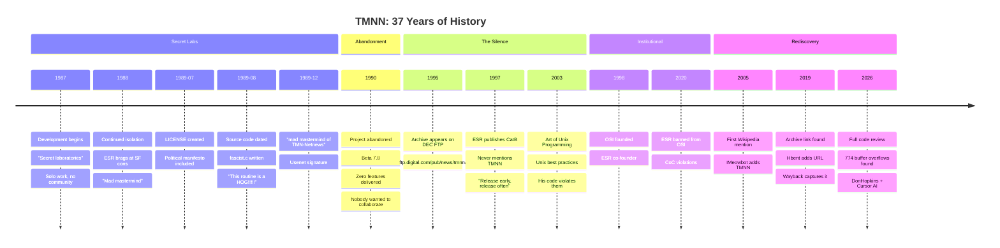
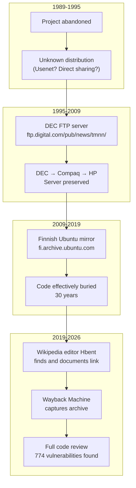

# The Timeline: From Secret Labs to Rediscovery

37 years of code archaeology.

**Source data:** [timeline.yml](timeline.yml)

---

## The Full Timeline

---

## Development Era (1987-1989)

### The "Secret Laboratories"

ESR began development around 1987 in what he would later call "secret laboratories" — his apartment at 22 South Warren Avenue, Malvern, PA.

For two years, he worked alone. No bazaar. No community. No "release early, release often."

### The Usenet Signature

By December 1989, ESR was signing his Usenet posts:

> "mad mastermind of TMN-Netnews"  
> — eric@snark.uu.net, comp.lang.misc, 1989-12-13

### The SF Convention Campaign

According to [DonHopkins' testimony](TESTIMONY.md), ESR spent these years cornering people at science fiction conventions to brag about TMNN:

> "He would corner people and drone on endlessly about it at inappropriate times."

### Key Dates from File Timestamps

| Date | Event | Evidence |
|------|-------|----------|
| 1989-07-10 | LICENSE and READ.ME created | File timestamps |
| 1989-08-01 | Bulk of source code | Timestamps on `src/*.c` |
| 1989-08-28 | Last modification | Makefile timestamp |

**Version at abandonment:** B3.0 (beta level 7.8)  
**Source:** [`src/version.h`](../src/version.h)

---

## The Silence (1990-2019)

### Promised Features Never Delivered

From the [BRAGSHEET](BRAGSHEET.md):

- ❌ Hypertext integration
- ❌ Public-key encryption
- ❌ Intelligent filtering agents
- ❌ "Distributed hypertext service"

**Delivered:** Nothing.

### The Archive Journey

### Meanwhile, ESR Became Famous

| Year | ESR Publication | The Irony |
|------|-----------------|-----------|
| 1997 | "Cathedral and the Bazaar" | Preached "release early" after 2 years in secret labs |
| 1998 | Co-founds OSI | Would be banned from it in 2020 |
| 2003 | "Art of Unix Programming" | His own code violates the practices |

*See: [CATB-IRONY.md](CATB-IRONY.md) | [OSI-BAN.md](OSI-BAN.md)*

---

## Rediscovery (2019-2026)

### Wikipedia Documentation

| Date | Editor | Action |
|------|--------|--------|
| 2005-01-11 | IMeowbot | First mention of TMNN added to B News article |
| 2019-12-05 | Hbent | Live archive link added |
| 2019-12-05 | Wayback | Archive captured |

### The 2026 Code Review

**Date:** January 30, 2026  
**Context:** Hacker News discussion about Usenet and ESR  
**Reviewers:** DonHopkins + Cursor AI

**Findings:**

| Category | Count |
|----------|-------|
| Buffer overflows | 774 |
| mktemp() race conditions | 42 |
| Command injections | 61 |
| gets() in headers | 1 |

**Notable discovery:** `fascist.c` with FASCIST/COMMUNIST compile flags

*Full details: [VULNERABILITIES.md](VULNERABILITIES.md)*

---

## The Resume Sanitization

How TMNN appears on [ESR's resume](http://catb.org/~esr/resume.html):

> "A rewrite of the USENET netnews software."

**7 words.** Compare to 47 words for martial arts.

What's missing:
- "Teenage Mutant Ninja Netnews" name
- "TMNN" acronym
- Beta status
- Abandonment
- Any promised features

*See: [RESUME.md](RESUME.md)*

---

## By The Numbers

| Metric | Value |
|--------|-------|
| Years in secret labs | 2 |
| Years code buried | 30 |
| Years until first public analysis | 37 |
| Many eyes on his code | ~0 |
| Bugs found shallow | None |

---

*See also: [VULNERABILITIES.md](VULNERABILITIES.md) — What the code review found | [IRONIES.md](IRONIES.md) — The contradictions*

*← Back to [README](README.md)*
