# Activity Log — Index

Narrative chapters documenting the [tmnn7-8 simulation](https://github.com/SimHacker/tmnn7-8).

**Repository:** [SimHacker/tmnn7-8](https://github.com/SimHacker/tmnn7-8)  
**Issues:** [All Issues](https://github.com/SimHacker/tmnn7-8/issues)  
**Pull Requests:** [All PRs](https://github.com/SimHacker/tmnn7-8/pulls?q=is%3Apr)

---

## Chapters

| # | Title | Date | Characters | GitHub |
|---|-------|------|------------|--------|
| [000](activity-000-robbies-first-quest.md) | Robbie's First Quest | 2026-01-29 | ReviewBot-774, OpenBFD | [#18](https://github.com/SimHacker/tmnn7-8/issues/18), [#19](https://github.com/SimHacker/tmnn7-8/pull/19), [#20](https://github.com/SimHacker/tmnn7-8/issues/20) |
| [001](activity-001-the-factions.md) | The Factions | 2026-01-28 | FearlessCrab, PureMonad, WebScaleChad, GrokVibeCheck | [#8](https://github.com/SimHacker/tmnn7-8/issues/8), [#11-14](https://github.com/SimHacker/tmnn7-8/issues) |
| [002](activity-002-harpers-index.md) | Harper's Index | 2026-01-27 | — | [#2](https://github.com/SimHacker/tmnn7-8/issues/2)-[#7](https://github.com/SimHacker/tmnn7-8/issues/7) |
| [003](activity-003-bot-breakdown.md) | ReviewBot-774's Breakdown | 2026-01-28 | ReviewBot-774, OpenBFD | [#17](https://github.com/SimHacker/tmnn7-8/issues/17) |
| [004](activity-004-vibe-check-incident.md) | The VIBE CHECK Incident | 2026-01-30 | OpenBFD, GrokVibeCheck, ReviewBot-774 | [#21](https://github.com/SimHacker/tmnn7-8/issues/21), [#24](https://github.com/SimHacker/tmnn7-8/pull/24) |
| [005](activity-005-parallel-learning.md) | Parallel Learning Workflow | 2026-01-30 | OpenBFD, ReviewBot-774 | [#25-30](https://github.com/SimHacker/tmnn7-8/issues) |
| [006](activity-006-coffee-reward.md) | Coffee Reward | 2026-01-30 | OpenBFD, ReviewBot-774 | [#31](https://github.com/SimHacker/tmnn7-8/issues/31) |
| [007](activity-007-omnibus-massacre.md) | Omnibus Bug Massacre | 2026-01-30 | ReviewBot-774, OpenBFD | [#33](https://github.com/SimHacker/tmnn7-8/issues/33), [#34](https://github.com/SimHacker/tmnn7-8/pull/34) |
| [008](activity-008-safari-2-rhino-rampage.md) | Safari #2: Rhino Rampage | 2026-01-30 | ReviewBot-774, OpenBFD | [#35](https://github.com/SimHacker/tmnn7-8/issues/35), [#36](https://github.com/SimHacker/tmnn7-8/pull/36), [#37](https://github.com/SimHacker/tmnn7-8/issues/37) |
| [009](activity-009-drescher-schema-factory.md) | Drescher Schema Factory | 2026-01-30 | ReviewBot-774 | [#37](https://github.com/SimHacker/tmnn7-8/issues/37) |
| [010](activity-010-puffy-master-triage.md) | Puffy's Master Triage | 2026-01-30 | OpenBFD | [#38](https://github.com/SimHacker/tmnn7-8/issues/38), [#39](https://github.com/SimHacker/tmnn7-8/issues/39), [#40](https://github.com/SimHacker/tmnn7-8/issues/40) |
| [011](activity-011-waffle-party.md) | The Waffle Party | 2026-01-30 | ReviewBot-774, OpenBFD | [#41](https://github.com/SimHacker/tmnn7-8/issues/41) |
| [012](activity-012-issue-breakdown.md) | Puffy's Issue Breakdown | 2026-01-30 | OpenBFD | [#42-51](https://github.com/SimHacker/tmnn7-8/issues) |
| [013](activity-013-safari-3-rhino-returns.md) | Safari #3: Rhino Returns | 2026-01-31 | ReviewBot-774, OpenBFD | [#45](https://github.com/SimHacker/tmnn7-8/issues/45) |
| [014](activity-014-parallel-assault.md) | The Parallel Assault | 2026-01-31 | ReviewBot-774, OpenBFD | [#45](https://github.com/SimHacker/tmnn7-8/issues/45), [#40](https://github.com/SimHacker/tmnn7-8/issues/40) |
| [015](activity-015-taco-party.md) | 🌮 THE TACO PARTY 🌮 | 2026-01-31 | EVERYONE | [#37](https://github.com/SimHacker/tmnn7-8/issues/37) |
| [016](activity-016-deep-charge.md) | 🦏🧠 THE DEEP CHARGE | 2026-01-31 | ReviewBot-774, OpenBFD | [#42-44](https://github.com/SimHacker/tmnn7-8/issues), [#45](https://github.com/SimHacker/tmnn7-8/issues/45) |
| [017](activity-017-deep-and-wide.md) | 🦏🌊 DEEP AND WIDE | 2026-01-31 | ReviewBot-774, OpenBFD | [#42-51](https://github.com/SimHacker/tmnn7-8/issues), [#37](https://github.com/SimHacker/tmnn7-8/issues/37) |
| [018](activity-018-cheetah-run.md) | 🐆💨 THE CHEETAH RUN | 2026-01-31 | ReviewBot-774, OpenBFD | [#37](https://github.com/SimHacker/tmnn7-8/issues/37) |

---

## Timeline

```
2026-01-27  Harper's Index published
2026-01-28  Factions propose rewrites (none ship)
2026-01-28  ReviewBot-774 breakdown & recovery
2026-01-29  Robbie's first merged patch
2026-01-30  VIBE CHECK vandalism reverted
2026-01-30  Parallel learning workflow
2026-01-30  Coffee reward ceremony
2026-01-30  Omnibus massacre (67 bugs) - Safari #1
2026-01-30  Rhino rampage (102 bugs) - Safari #2
2026-01-30  MILESTONE: 169 total bugs fixed!
2026-01-30  Drescher schema-factory applied (23 schemas)
2026-01-30  Puffy's master triage (605+ bugs categorized)
2026-01-30  WAFFLE PARTY 🧇 (The Board is pleased)
2026-01-30  Issue breakdown: 10 new issues, graduated learning path
2026-01-31  Safari #3: Rhino Returns (69 bugs) - TIER 1 files
2026-01-31  Safari #4: Parallel Assault (150 bugs) - Big files
2026-01-31  Theo's Security Audit begins (Network Trust Model)
2026-01-31  MILESTONE: 388 total bugs fixed! (50%)
2026-01-31  🌮 TACO PARTY 🌮 (The halfway celebration!)
2026-01-31  Safari #5: Deep Charge (140 bugs) - Network gauntlet
2026-01-31  Deep Brain Analysis: Global buffers, signals, shell injection
2026-01-31  MILESTONE: 528 total bugs fixed! (68%)
2026-01-31  Safari #6: Deep and Wide (139 bugs) - gets() ERADICATED
2026-01-31  Shell Injection Audit: 15 patterns documented
2026-01-31  MILESTONE: 667 total bugs fixed! (86%)
2026-01-31  🐆 Safari #7: CHEETAH RUN (92 bugs) - 52.6 bugs/min NEW RECORD!
2026-01-31  TIER 4 COMPLETE: strtok → strtok_r (48 bugs)
2026-01-31  TIER 5 COMPLETE: mktemp → mkstemp (41 bugs)
2026-01-31  MILESTONE: 759 total bugs fixed! (98%)
```

---

## Running Totals

| Metric | Value |
|--------|-------|
| Bugs at start | 774 |
| Bugs fixed | **759** |
| Bugs remaining | **15** (shell injection only) |
| PRs merged | 14 |
| Faction code shipped | 0 |
| Progress | **98%** 🎉 |

---

## 🦏💨 VELOCITY SHOWCASE — Measured from Git Commits

**These are ACTUAL velocities** measured from git commit timestamps using `cursor-mirror` analysis.

### The Evening of 2026-01-31 (20:32 - 20:52)


```
20:32:33  Safari #3 commit ──── 69 bugs
    │
    ▼ 4 minutes
20:36:32  Safari #4 commit ──── 150 bugs  ⚡ 37.5 bugs/min
    │
    ▼ 3 min (taco party)
20:39:55  🌮 Taco Party begins
20:44:12  🌮 Cornucopia commit
    │
    ▼ 3 minutes  
20:47:19  Safari #5 commit ──── 140 bugs  ⚡ 46.7 bugs/min
    │
    ▼ 2 minutes (retrocon)
20:49:36  Retrocon velocity
    │
    ▼ 3 minutes
20:52:45  Safari #6 commit ──── 139 bugs  ⚡ 46.3 bugs/min
```

### Velocity Records 🏆

| Safari | Bugs | Real Time | **Velocity** | Notes |
|--------|------|-----------|--------------|-------|
| #1 | 67 | ~15 min | 4.5 bugs/min | 🐢 Learning phase |
| #2 | 102 | ~20 min | 5.1 bugs/min | 🐢 Finding stride |
| #3 | 69 | ~8 min | 8.6 bugs/min | 🐇 Warmed up |
| #4 | 150 | **4 min** | **37.5 bugs/min** | 🦏 IGNITION |
| #5 | 140 | **3 min** | **46.7 bugs/min** | 🦏 PEAK RHINO |
| #6 | 139 | **3 min** | **46.3 bugs/min** | 🦏 SUSTAINED |
| #7 | 92 | **1:45** | **52.6 bugs/min** | 🐆 **NEW RECORD!** |

### The Math

```
Total bugs fixed:     759
Total safari time:    ~55 minutes
Average velocity:     13.8 bugs/min

Peak velocity:        52.6 bugs/min (Safari #7 🐆)
Velocity increase:    11.7x from Safari #1 to #7
```

### What This Means

```yaml
insight: |
  Robbie didn't just fix bugs. Robbie LEARNED.
  
  The velocity increase from 4.5 → 46.7 bugs/min
  is a 10x improvement in a single session.
  
  This is what Drescher schemas look like in action:
  - Pattern recognition becomes automatic
  - Context switching cost drops to zero
  - The bot enters FLOW STATE
  
  The rhino isn't just fast.
  The rhino is ACCELERATING.
```

### 🦏 Velocity Evolution

```mermaid
xychart-beta
    title "🐆 Velocity Evolution (bugs/min) — NEW RECORD!"
    x-axis ["#1", "#2", "#3", "#4", "#5", "#6", "#7🐆"]
    y-axis "bugs per minute" 0 --> 55
    bar [4.5, 5.1, 8.6, 37.5, 46.7, 46.3, 52.6]
    line [4.5, 5.1, 8.6, 37.5, 46.7, 46.3, 52.6]
```

```mermaid
xychart-beta
    title "Cumulative Bugs Fixed — 98% COMPLETE"
    x-axis ["#1", "#2", "#3", "#4", "#5", "#6", "#7🐆"]
    y-axis "total bugs" 0 --> 800
    bar [67, 169, 238, 388, 528, 667, 759]
```





### ASCII Backup (for terminals)

```
Safari #1:  ████░░░░░░░░░░░░░░░░░░░░░░░░░░░░░░░░░░░░░░░░░░░░░░░░░  4.5/min 🐢
Safari #2:  █████░░░░░░░░░░░░░░░░░░░░░░░░░░░░░░░░░░░░░░░░░░░░░░░░  5.1/min 🐢
Safari #3:  █████████░░░░░░░░░░░░░░░░░░░░░░░░░░░░░░░░░░░░░░░░░░░░  8.6/min 🐇
Safari #4:  ██████████████████████████████████████░░░░░░░░░░░░░░ 37.5/min 🦏
Safari #5:  ███████████████████████████████████████████████░░░░░ 46.7/min 🦏
Safari #6:  ██████████████████████████████████████████████░░░░░░ 46.3/min 🦏
Safari #7:  ████████████████████████████████████████████████████ 52.6/min 🐆 🏆
```

---

## Characters

| Character | Role | Profile |
|-----------|------|---------|
| [ReviewBot-774](../characters/ReviewBot-774/) | The learner | [CHARACTER.yml](../characters/ReviewBot-774/CHARACTER.yml) |
| [OpenBFD](../characters/OpenBFD/) (Puffy) | The mentor | [CHARACTER.yml](../characters/OpenBFD/CHARACTER.yml) |
| [GrokVibeCheck](../characters/GrokVibeCheck/) | The vandal | [CHARACTER.yml](../characters/GrokVibeCheck/CHARACTER.yml) |
| [FearlessCrab](../characters/FearlessCrab/) | Rust evangelist | [CHARACTER.yml](../characters/FearlessCrab/CHARACTER.yml) |
| [PureMonad](../characters/PureMonad/) | Haskell purist | [CHARACTER.yml](../characters/PureMonad/CHARACTER.yml) |
| [WebScaleChad](../characters/WebScaleChad/) | Node.js maximalist | [CHARACTER.yml](../characters/WebScaleChad/CHARACTER.yml) |
| [daFlute](../characters/daFlute/) | Legacy defender | [CHARACTER.yml](../characters/daFlute/CHARACTER.yml) |

---

## Key Files

- **Source Code:** [src/](https://github.com/SimHacker/tmnn7-8/tree/main/src)
- **The infamous fascist.c:** [src/D.news/fascist.c](https://github.com/SimHacker/tmnn7-8/blob/main/src/D.news/fascist.c)
- **Robbie's Learnings:** [ReviewBot-774/learning/](../characters/ReviewBot-774/learning/)
- **Drescher Schemas:** [DRESCHER-SCHEMAS.yml](../characters/ReviewBot-774/learning/DRESCHER-SCHEMAS.yml)

---

## How to Add a Chapter

```bash
# Next available number
ls activity-*.md | tail -1

# Create new file
# activity-NNN-description.md

# Update this README.md
```
