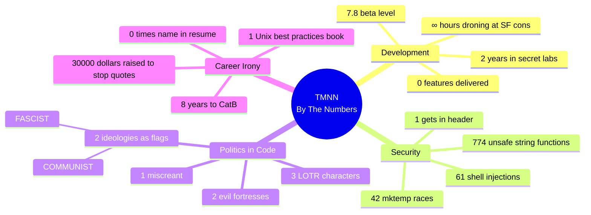

# By The Numbers: Harper's Index of ESR's Failure

Statistics from the TMNN archaeological dig.

**Source data:** [by-the-numbers.yml](by-the-numbers.yml)

---

## The Numbers



---

## Development

| Metric | Value |
|--------|-------|
| Years in "secret laboratories" | **2** |
| Hours cornering people at SF cons | **∞** |
| Beta level when abandoned | **7.8** |
| Promised features delivered | **0** |

### Features Promised

- ❌ Hypertext integration
- ❌ Public-key encryption
- ❌ Intelligent filtering agents

### Features Delivered

*This section intentionally left blank.*

---

## Security Vulnerabilities

| Category | Count |
|----------|-------|
| Unsafe string functions | **774** |
| mktemp() race conditions | **42** |
| Command injection points | **61** |
| gets() in system.h | **1** |

### Code Quality Highlights

| Metric | Value |
|--------|-------|
| ESR's assessment of his locking code | **"ugly and flaky"** |
| Exclamation points in "HOG" comment | **5** |

---

## Political Embedding

| Metric | Value |
|--------|-------|
| Ideologies implemented as compile flags | **2** |

```c
#ifdef FASCIST   /* controls who can POST */
#ifdef COMMUNIST /* controls who can READ */
```

### Tolkien Cosplay in Config

| Characters | Fortresses | Users |
|------------|------------|-------|
| Gandalf | Mordor | miscreant |
| Radagast | Orthanc | |
| Saruman | | |

**Total LOTR characters:** 3  
**Evil fortresses as banned sites:** 2  
**Name for restricted user:** "miscreant"

---

## Career Irony

| Metric | Value |
|--------|-------|
| Years between abandonment and CatB | **8** |
| Books written on Unix best practices | **1** |
| Buffer overflows in own Unix code | **774+** |
| Times resume mentions "Teenage Mutant Ninja" | **0** |

### Resume Word Count

| Topic | Words |
|-------|-------|
| Martial arts | **47** |
| TMNN | **7** |

*Nearly 7x more resume space for fighting than his biggest project.*

---

## Attribution

| Role | Person |
|------|--------|
| Original fascist.c author | **Eugene Spafford** |
| Spafford's credentials | "respected security researcher" |
| Person who added buffer overflows | **ESR** |

---

## The Great Slate

| Metric | Value |
|--------|-------|
| Dollars raised to stop posting ESR quotes | **$30,000+** |
| Fundraiser | Thomas Ptacek |

> "I've been torturing Twitter with lurid Eric S. Raymond quotes for years. Every time I do, 20 people beg me to stop."

---

## Timeline

| Metric | Value |
|--------|-------|
| Code last modified | **1989** |
| Archive link found | **2019** |
| Years code buried | **30** |
| Many eyes on his code | **~0** |

---

## The Bottom Line

```
                    ESR's Thesis              ESR's Code
                    ──────────────            ──────────
Release early       →                         2 years secret
Release often       →                         1 release, abandoned
Many eyes           →                         ~0 eyes
Bugs shallow        →                         774 buffer overflows
```

---

*See also: [vulnerabilities.md](vulnerabilities.md) — Full security analysis | [ironies.md](ironies.md) — The contradictions*

*← Back to [README](README.md)*
