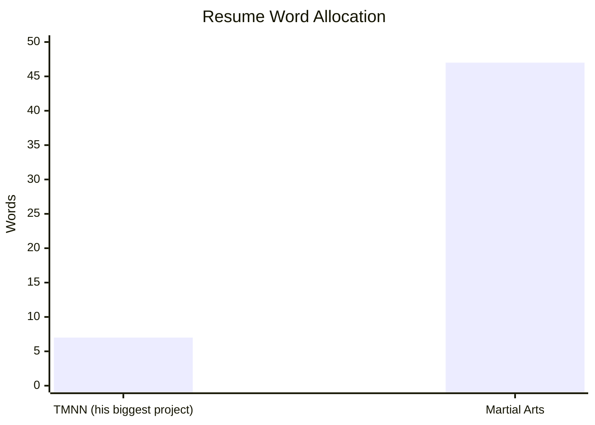
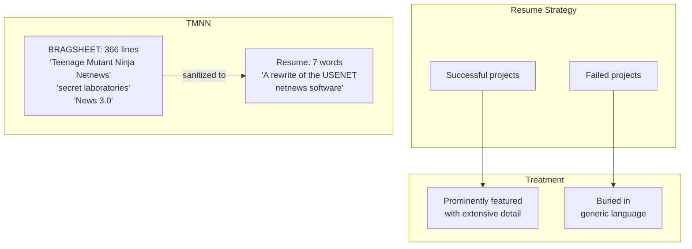

# The Resume: How ESR Buries TMNN

The art of strategic omission.

**Source data:** [esr-resume-analysis.yml](esr-resume-analysis.yml) | [esr-silence.yml](esr-silence.yml)

---

## The Entry

How TMNN appears on [ESR's official resume](http://catb.org/~esr/resume.html):

> "A rewrite of the USENET netnews software."

**Seven words.**

---

## What's Missing

| In the BRAGSHEET | On the Resume |
|------------------|---------------|
| "Teenage Mutant Ninja Netnews" | ❌ |
| "TMNN" | ❌ |
| "News 3.0" | ❌ |
| "Beta level 7.8" | ❌ |
| "Abandoned" | ❌ |
| "Two years in secret laboratories" | ❌ |
| Promised features | ❌ |
| Delivered features | ❌ (there were none) |

---

## The Word Count Comparison

| Topic | Words |
|-------|-------|
| His biggest coding project | **7** |
| Martial arts credentials | **47** |

*Nearly 7x more resume space for fighting than for the project he spent 2 years on and promoted at every SF convention.*

---

## What He DOES Brag About

### ESR's Self-Assessment: "Ego is for little people"

In 2009, ESR wrote a blog post titled "Ego is for little people" ([source](http://esr.ibiblio.org/?p=1404)) that included this remarkable passage:

> I'm going to use myself as an example now, mainly because I don't know anyone else's story well enough to make the point I want to with it. I'm the crippled kid who became a black-belt martial artist and teacher of martial artists. I've made the New York Times bestseller list as a writer. You can hardly use a browser, a cellphone, or a game console without relying on my code. I've been a session musician on two records. **I've blown up the software industry once, reinvented the hacker culture twice, and am without doubt one of the dozen most famous geeks alive. Investment bankers pay me $300 an hour to yak at them** because I have a track record as a shrewd business analyst. I don't even have a BS, yet there's been an entire academic cottage industry devoted to writing exegeses of my work. I could do nothing but speaking tours for the rest of my life and still be overbooked. **Earnest people have struggled their whole lives to change the world less than I routinely do when I'm not even really trying.**

*The post is titled "Ego is for little people." Unironically.*

### "Am I the most famous programmer?"

In 2015, ESR wrote another blog post ([source](http://esr.ibiblio.org/?p=6839)) that began:

> My wife Cathy asked me a simple question last night, and I realized I didn't have an answer to it. "Are you" she asked "the most famous programmer in the world?"

*He then spends the post seriously analyzing the question.*

### The New Hacker's Dictionary

> "I conceived and edited The New Hacker's Dictionary (MIT Press, 1991). This book received enthusiastic reviews in The New York Times, PC Magazine, Byte, PC World, UNIX Review, IEEE Spectrum..."

**Reality:** Appropriated MIT-AI Lab community document. *See: [jargon-file.md](jargon-file.md)*

### GNU Emacs

> "I have been an active member of the GNU project, and was principally responsible for EMACS Lisp maintenance between December 1991 and June 1993."

**Later:** Spent career attacking FSF and RMS.

### The Cathedral and the Bazaar

> "This book reached #7 on the New York Times's list of business-book bestsellers."

**Reality:** "CATB has just not held up at all; it's actively bad." — tptacek

### Netscape Claim

> "This paper was subsequently described by Netscape Communications, Inc., as a major factor in their decision to release their client software as open source."

**Brendan Eich's clarification:**

> "CatB was waved around (not sure that the most ardent wavers actually read it) inside Netscape in late 1997 as a gesture to support the argument."

*"Waved around as a gesture" ≠ "major factor"*

---

## The Personal Data Section

ESR's resume includes:

- **Martial arts:** "World Tae-Kwon-Do Federation 1st Dan Black Belt"
- **Weapons:** "SCA heavy weapons"
- **Firearms:** "especially target and tactical pistol shooting"
- **Novel:** "SF, titled Shadows and Stars, nearly completed"

*The novel was never published either.*

---

## The Silence

**Search:** `site:esr.ibiblio.org "TMNN" OR "Teenage Mutant Ninja Netnews"`  
**Result:** No results found

ESR has never publicly mentioned TMNN on his blog despite:
- Writing extensively about his other projects
- Writing extensively about open source history
- Calling himself the "mad mastermind" in 1989

### Topics ESR Covers on His Blog

- ✅ Software development methodology
- ✅ Open source philosophy
- ✅ Unix history
- ✅ His own projects (fetchmail, gpsd)
- ✅ Political commentary
- ✅ Guns
- ✅ "Sex Tips for Geeks"
- ❌ Teenage Mutant Ninja Netnews

---

## The Pattern

---

## Why The Erasure Matters

### CatB Contradiction

"The Cathedral and the Bazaar" argues for open development. TMNN was developed secretly for 2 years. Acknowledging TMNN would undermine the essay's credibility.

### Code Quality Contradiction

"The Art of Unix Programming" teaches best practices. TMNN code is riddled with security vulnerabilities. Acknowledging TMNN would undermine his authority.

### Many Eyes Contradiction

"Linus's Law" claims many eyes make bugs shallow. TMNN had no eyes and was abandoned with hundreds of unfixed bugs. Acknowledging TMNN would disprove his most famous claim.

---

## The Conclusion

> The guy who made his career writing about open source development, hacker history, and his own contributions to both... has never once mentioned his first major project, which contradicts everything he later became famous for claiming.
>
> The silence is the confession.

---

*See also: [timeline.md](timeline.md) — The full chronology | [ironies.md](ironies.md) — The contradictions*

*← Back to [README](README.md)*
