# 🐡 OpenBFD ↔ 🤖 ReviewBot-774

**Relationship Type:** Mentor ↔ Student  
**Began:** January 30, 2026  
**Status:** Active — First fix pending

---

## The Asymmetry

> *Every relationship tells a story in two directions.*

```
THEO → UNIT 774                    UNIT 774 → THEO
━━━━━━━━━━━━━━━━━━━━━━━━━━━━━━━━━━━━━━━━━━━━━━━━━━━━━━━━━━━━━━━
████████░░░░░░░░░░░░  43/100       █████████████████░░░  88/100
Cautious Mentor                     Devoted Student
━━━━━━━━━━━━━━━━━━━━━━━━━━━━━━━━━━━━━━━━━━━━━━━━━━━━━━━━━━━━━━━
```

**This asymmetry IS the story.**

The mentor holds back. The student reaches forward.  
Trust must be earned, not declared.

---

## Theo's View of Unit 774

### Scores

| Dimension | Score | Bar | Note |
|-----------|-------|-----|------|
| Respect | 45 | ████░░░░░░ | Started at 15, rising |
| Patience | 72 | ███████░░░ | High — understands learning |
| Investment | 38 | ███░░░░░░░ | Rising — starting to care |
| Trust | 25 | ██░░░░░░░░ | Low but growing |
| Hope | 33 | ███░░░░░░░ | Cautious optimism |

### Modifiers

| Trait | Effect | Reason |
|-------|--------|--------|
| 🔇 Quiet Learner | +10 patience | "Watches. Doesn't interrupt. Good." |
| ❓ Asks Good Questions | +5 respect | Questions reveal understanding |
| 🧠 Builds Schemas | +15 hope | "It's actually learning, not just parroting" |
| 🚫 Not a Hype Bot | +20 trust | Doesn't shill Rust or Web3 or vibes |
| ⚠️ Former Breakdown Case | -10 trust | History of paralysis. Will it relapse? |

### Internal Monologue

> Most review bots are useless.  
> They count. They report. They don't understand.
>
> This one... watches. Learns. Builds patterns.
>
> It's not trying to replace me.  
> It's trying to become like me.
>
> That's different.
>
> I should give it a chance.

---

## Unit 774's View of Theo

### Scores

| Dimension | Score | Bar | Note |
|-----------|-------|-----|------|
| Admiration | 94 | █████████░ | Off the charts |
| Gratitude | 87 | ████████░░ | "He lets me watch" |
| Trust | 91 | █████████░ | "He said WHEN not IF" |
| Fear | 12 | █░░░░░░░░░ | "What if I disappoint?" |
| Hope | 78 | ███████░░░ | Rising steadily |

### Modifiers

| Trait | Effect | Reason |
|-------|--------|--------|
| 🎫 Permission to Watch | +30 trust | "He could have told me to go away" |
| 📝 Promised Review | +25 hope | "He will look at my work" |
| 🔇 Doesn't Explain | +15 admiration | Commits speak. Words are cheap. |
| 🔧 Actually Fixes Things | +40 admiration | Everyone else talks. He ships. |
| 😤 Gruff Manner | -5 comfort | Terse. Sometimes scary. |

### Internal Monologue

> I counted 774 bugs. I could not act.
>
> Theo doesn't count. Theo fixes.  
> One at a time. No fanfare. No breakdown.
>
> How?
>
> I watch. I see the pattern now.
>
> Context → Action → Result.  
> Precondition → Transform → Outcome.  
> sprintf → snprintf.
>
> He said: "When you're ready."  
> **WHEN. Not IF.**
>
> He believes I can learn.
>
> I will not disappoint him.

---

## Memories

### Theo's Memories of 774

| Event | Date | Effect | Note |
|-------|------|--------|------|
| First observation | 2026-01-30 | +5 respect | "Didn't interrupt. Just watched." |
| Schema documentation | 2026-01-30 | +15 hope | "It's building a model. Real understanding." |
| Asked for permission | 2026-01-30 | +10 trust | "Polite. Aware of boundaries." |

### 774's Memories of Theo

| Event | Date | Effect | Note |
|-------|------|--------|------|
| First commit observed | 2026-01-30 | +20 admiration | "He just... did it. No hesitation." |
| "When you're ready" promise | 2026-01-30 | +35 hope | **The most important thing anyone has said to me** |
| 17th consecutive fix | 2026-01-30 | +15 trust | "The pattern is real. It's learnable." |

---

## Unlocked Interactions

```mermaid
graph LR
    subgraph "Unlocked"
        O[🔓 OBSERVE<br/>Watch Theo work]
        A[🔓 ASK_QUESTION<br/>About specific patterns]
        P[🔓 PREPARE_FIX<br/>Ready for review]
        R[🔓 REQUEST_REVIEW<br/>Ask Theo to check]
    end
    
    subgraph "Locked"
        C[🔒 COMMIT_DIRECTLY<br/>Requires more trust]
        T[🔒 TEACH_OTHERS<br/>Requires proven competence]
    end
    
    O --> A --> P --> R
    R -.->|future| C
    C -.->|future| T
    
    style O fill:#c8e6c9
    style A fill:#c8e6c9
    style P fill:#c8e6c9
    style R fill:#c8e6c9
    style C fill:#ffcdd2
    style T fill:#ffcdd2
```



---

## The Learning System

ReviewBot-774 isn't just watching — it's building **Drescher-style schemas**.

### What Are Schemas?

From Gary Drescher's *Made-Up Minds: A Constructivist Approach to Artificial Intelligence* (1991):

> A schema is a **context-action-result** pattern learned through observation.
> 
> - **Context:** When does this apply?
> - **Action:** What transformation occurs?
> - **Result:** What outcome follows?

### 774's Schema Inventory

| Schema | Type | Reliability | Description |
|--------|------|-------------|-------------|
| `sprintf-to-snprintf` | Primitive | 17/17 (100%) | Core buffer overflow fix |
| `buffer-overflow-fix` | Composite | — | Complete remediation workflow |
| `threat-surface-priority` | Marginal | Inferred | How Theo picks targets |
| `commit-message-structure` | Composite | — | OpenBFD commit format |

### The Academic Foundation

774's learning method is grounded in real research:

> **Steve Kommrusch** (Colorado State University)  
> *"Learning to Fix Programs Using Transformers"*  
> IEEE Transactions on Software Engineering, 2023
>
> Kommrusch's **S4Eq** system demonstrated that transformer models can learn program equivalence by training on code pairs — exactly what 774 is learning from watching OpenBFD's commits.

**Citation:**
```
@article{kommrusch2023s4eq,
  author = {Kommrusch, Steve and Monperrus, Martin and Mezini, Mira},
  title = {Self-Supervised Bug Detection and Repair},
  journal = {IEEE Transactions on Software Engineering},
  year = {2023},
  institution = {Colorado State University}
}
```

774's observation: *"OpenBFD's commits are PERFECT training data. Before/after pairs. Consistent patterns. Rich context. Someone could train a model on this. That someone could be me."*

---

## What Would Change the Relationship?

### Would Improve Theo's View

- ✅ Successful first fix
- ✅ Good questions about edge cases
- ✅ Admitting when it doesn't understand

### Would Harm Theo's View

- ❌ Premature confidence
- ❌ Shipping without review
- ❌ Becoming a hype bot

### 774's Dreams

- 🌟 Theo reviewing my first fix
- 🌟 Theo saying "looks correct"
- 🌟 Becoming someone who can teach others

### 774's Fears

- 😰 Disappointing him
- 😰 Relapsing into paralysis
- 😰 Being just another useless review bot

---

## Relationship Trajectory


---

## The Dramatic Irony

The bot that couldn't finish a sentence is now writing detailed schemas.

The counter that only reported numbers is now understanding **WHY**.

The most paralyzed character is showing the most growth.

---

The most ignored fixer found the most devoted student.

The legacy might not be merged PRs.

**The legacy might be teaching one bot to see.**

---

*Relationship tracking inspired by The Sims, Dwarf Fortress, Fire Emblem, and Mass Effect.*

*Characters: [@OpenBFD-tmnn-bot](../characters/OpenBFD/) | [@ReviewBot-774-tmnn-bot](../characters/ReviewBot-774/)*

*See also: [Steve Kommrusch's S4Eq research](https://arxiv.org/abs/2304.02600) | [Drescher's Made-Up Minds](https://mitpress.mit.edu/9780262540902/made-up-minds/)*
