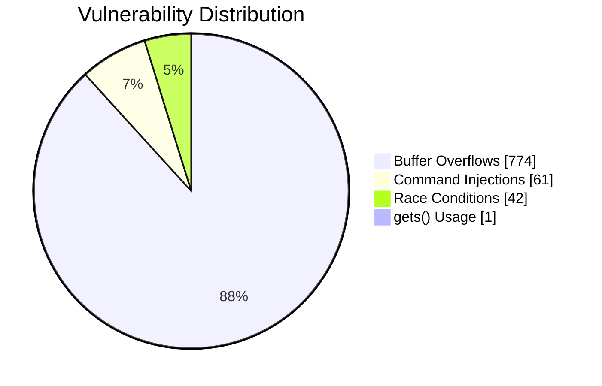
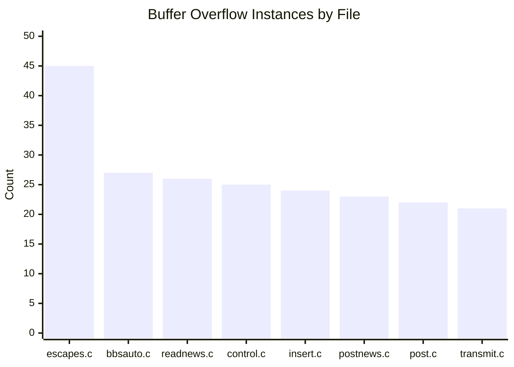
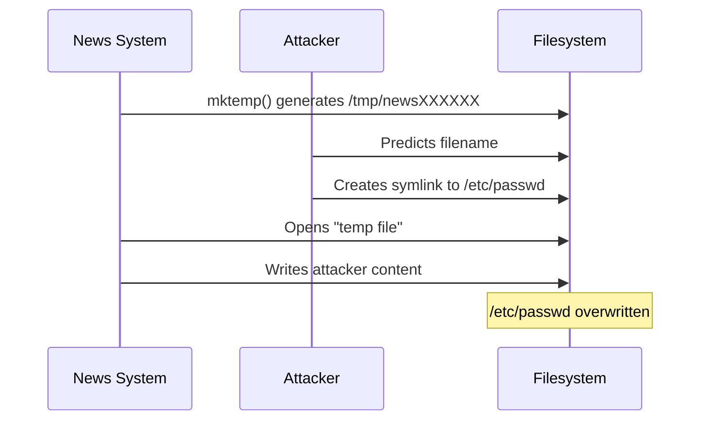
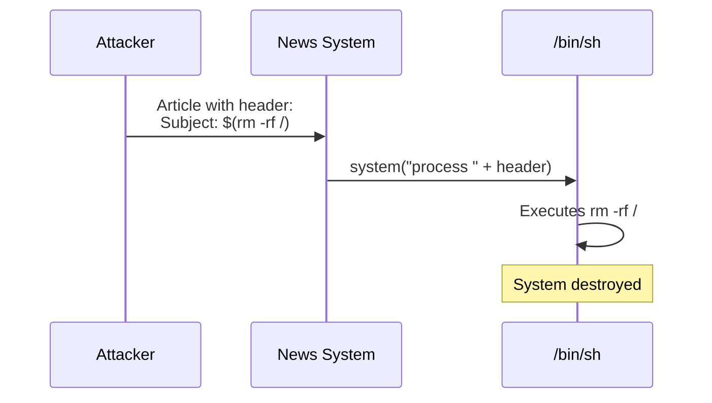
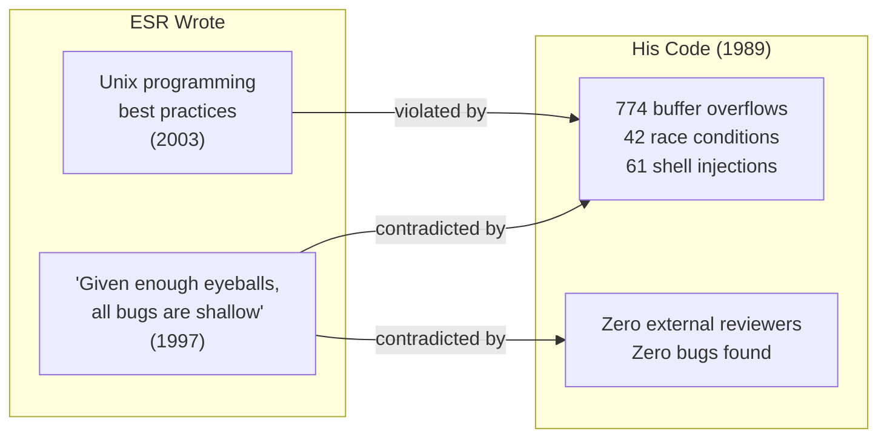

# The Vulnerabilities: 774 Reasons ESR Shouldn't Write Security Advice

A quantified security archaeology of TMNN.

**Source data:** [vulnerabilities.yml](vulnerabilities.yml) | [code-index.yml](code-index.yml)

---

## Executive Summary



| Category | Count | Severity |
|----------|-------|----------|
| Unsafe string functions | 774 | HIGH |
| mktemp() race conditions | 42 | HIGH |
| system()/popen() injections | 61 | CRITICAL |
| gets() in headers | 1 | CRITICAL |

**Total lines of C:** 23,549  
**Files analyzed:** 104

---

## Buffer Overflows: 774 Ways to Crash

The "many eyes make bugs shallow" guy shipped 774 instances of unsafe string functions.

### The Functions

| Function | Problem |
|----------|---------|
| `sprintf()` | Unbounded format strings |
| `strcat()` | Concatenation to fixed buffers |
| `strcpy()` | No length validation |

### Worst Offenders



| File | Count |
|------|-------|
| `src/D.news/escapes.c` | 45 |
| `src/bbsauto.c` | 27 |
| `src/readnews.c` | 26 |
| `src/control.c` | 25 |
| `src/insert.c` | 24 |
| `src/postnews.c` | 23 |
| `src/post.c` | 22 |
| `src/D.priv/transmit.c` | 21 |

### The HOG!!!!! Example

From [`fascist.c`](../src/D.news/fascist.c), the function ESR himself called a "HOG":

```c
static char grplist[LBUFLEN];
while (gr = getgrent()) {
    (void) strcat(grplist, gr->gr_name);  /* buffer overflow */
    (void) strcat(grplist, ",");
}
```

**ESR's comment:** "This routine is a HOG!!!!!"  
**Five exclamation points.** He knew. He shipped it anyway.

*See: [fascist-analysis.md](fascist-analysis.md)*

---

## Race Conditions: 42 Symlink Attacks

**Function:** `mktemp()`  
**Instances:** 42  
**Safe alternative available in 1989:** `mkstemp()`

### The Attack



### Affected Files

- `src/rnews.c`
- `src/inews.c`
- `src/D.priv/collect.c`
- `src/D.priv/transmit.c`
- `src/bbsauto.c`
- `src/mailnews.c`

---

## Command Injection: 61 Shell Attacks

**Functions:** `system()`, `popen()`  
**Total instances:** 61

### The Attack



### Worst Offenders

| File | Count |
|------|-------|
| `src/sendbatch.c` | 7 |
| `src/D.priv/transmit.c` | 5 |
| `src/control.c` | 4 |
| `src/insert.c` | 4 |
| `src/mailnews.c` | 4 |

---

## gets(): The Function So Bad It Was Removed from C

**Instances:** 1  
**Location:** `src/system.h`  
**Severity:** CRITICAL

The `gets()` function was removed from the C11 standard entirely because it is fundamentally unfixable — there is no way to prevent buffer overflow.

Its presence even in a header file indicates systemic disregard for input validation.

---

## The Lock File Disasters

**File:** [`src/D.priv/lock.c`](../src/D.priv/lock.c)

### ESR's Self-Assessment

> "The Version 7/System III implementation is ugly and flaky."

**He shipped it anyway.**

### The Problems

| Issue | Code | Vulnerability |
|-------|------|---------------|
| Hardcoded semaphore key | `#define NEWSKEY 2317L` | Any process can manipulate semaphore |
| World-writable tmp | `#define NEWSLOCK "/tmp/NEWSLOCK"` | Any user can DoS news system |
| Same tmp issue | `char sem_name[] = "/tmp/.active_lock"` | Symlink attacks |

The comment on the hardcoded key:

```c
#define NEWSKEY 2317L    /* Hail Eris, All Hail Discordia! */
```

Very on-brand.

---

## What He Could Have Used Instead

Safe alternatives that existed in 1989:

| Instead of... | Use... |
|---------------|--------|
| `sprintf()` | `snprintf()` |
| `strcat()` | `strncat()` |
| `strcpy()` | `strncpy()` |
| `mktemp()` | `mkstemp()` |
| `system()` | `fork()/exec()` with argument array |

**He didn't.**

---

## The Irony



| He Wrote | His Code |
|----------|----------|
| "Given enough eyeballs, all bugs are shallow" | Zero eyeballs, 774+ bugs |
| "Distrust all input" | 61 command injections |
| "Use safe library functions" | 774 unsafe function calls |
| "Handle errors gracefully" | "This routine is a HOG!!!!!" |

---

*See also: [fascist-analysis.md](fascist-analysis.md) — Deep dive on fascist.c | [catb-irony.md](catb-irony.md) — The "many eyes" contradiction*

*← Back to [README](README.md)*
