# GitHub as Literature

*A deconstruction of commit messages, issues, and code reviews as a new literary genre.*

> **Source**: This page is derived from a MOOLLM session.
> See: [moollm/examples/adventure-4/characters/real-people/don-hopkins/sessions/deconstruct-github/](https://github.com/SimHacker/moollm/tree/main/examples/adventure-4/characters/real-people/don-hopkins/sessions/deconstruct-github/)

## The Annie Hall Protocol

In the film *Annie Hall* (1977), Woody Allen's character is stuck in a movie line behind a pompous academic misquoting Marshall McLuhan. Allen steps out of the frame, produces the actual McLuhan from behind a movie poster, who tells the academic: "You know nothing of my work."

**This protocol**: When someone makes authoritative claims about a field, invoke the actual authorities to check the claim.

For this analysis, we invoke:
- **Chip Morningstar** — ["How to Deconstruct Almost Anything"](https://www.fudco.com/chip/deconstr.html) (1993)
- **Marshall McLuhan** — "The medium is the message"

## The Thesis

Issue discussions, commit messages, PR comments, and code reviews constitute a **new literary genre** with its own conventions, rhetoric, and critical apparatus.

## The Commit Message as Literary Form

### Ostensible Purpose
Document what changed and why.

### Actual Functions

The "meaning" of a commit message exceeds its content.

## GitHub as Medium

McLuhan's insight: "The medium is the message."

**GitHub is:**
- Threaded (conversations branch and merge like code)
- Persistent (nothing is truly deleted)
- Public by default (performative)
- Linked (everything references everything)
- Accountable (tied to identities)
- Searchable (the panopticon is mutual)

The medium SHAPES the literature produced within it.

A commit message on GitHub is not the same artifact as a commit message in a private corporate repo, even if the text is identical.

## The Convention is the Suppression

Standard commit message conventions:
- Imperative mood ("Fix bug" not "Fixed bug")
- 50 character subject line
- Blank line before body
- Wrap at 72 characters

**What this suppresses:**
- Uncertainty ("Fix bug" implies confidence)
- Process ("Fix bug" hides the hours of debugging)
- Collaboration (single author attribution)
- Emotion (no room for "Finally fix this @#$% bug")

The convention creates an **idealized author**: confident, terse, methodical, emotionless.

Violating these conventions is a **rhetorical move**.

## Case Study: OpenBFD's Commits

[OpenBFD's commit messages](https://github.com/SimHacker/tmnn7-8/commits/actual-fixes) on this repository demonstrate the literary potential:

Each commit is:
- **Technical** (fixes real bugs)
- **Rhetorical** (argues a position)
- **Historical** (cites dates and events)
- **Philosophical** (interrogates assumptions)
- **Performative** (meant to be read)

### Example: Commit `ff2e618`

Fixes a `sprintf()` buffer overflow. The commit message includes:

> The original comment reads:
> "Yes, it's OK to use popen(3) here. Forging mail is trivial anyhow..."
>
> This is the security mindset of the era, preserved in amber.
>
> "Forging mail is trivial" — true.
> "Therefore don't worry about buffer overflow in popen() argument" — ???
>
> This is like saying "locks are pickable, therefore don't bother closing your door."

This is simultaneously:
- A bug fix (code change)
- A historical document (quotes original comment)
- A security analysis (identifies the flaw in reasoning)
- An essay (uses analogy for rhetorical effect)
- A critique (of both the code and its author's mindset)

**All in one commit message.**

## Scholarship and Practice Merged

```mermaid
graph TB
    subgraph "Traditional Scholarship"
        direction TB
        TW[📝 Written in journals]
        TR[👥 Peer reviewed]
        TC[📚 Cited formally]
        TS[🔀 Separated from practice]
    end
    
    subgraph "GitHub Scholarship"
        direction TB
        GW[💬 Written in commits & issues]
        GR[👁️ Reviewed by watchers]
        GL[🔗 Linked directly to code]
        GE[⚡ EMBEDDED in practice]
    end
    
    TW -.->|transforms to| GW
    TR -.->|becomes| GR
    TC -.->|becomes| GL
    TS -.->|inverts to| GE
    
    style TW fill:#ffcdd2
    style TR fill:#ffcdd2
    style TC fill:#ffcdd2
    style TS fill:#ffcdd2
    style GW fill:#c8e6c9
    style GR fill:#c8e6c9
    style GL fill:#c8e6c9
    style GE fill:#c8e6c9
```

The medium has collapsed the distinction between "writing about code" and "writing code."

## Authority is Summonable

GitHub institutionalizes the Annie Hall move:

- "You misunderstand ESR's position." → @esrays please clarify
- "That's not how React works." → Link to Dan Abramov's tweet
- "The RFC says..." → Link to RFC with highlighted section

The medium enables **instant authority invocation**.

This changes argument structure. You can't just make claims about what authorities think. You have to SUMMON them.

The movie poster is always right there.

## Conclusions

1. **GitHub is a literary medium** — Issues, commits, PRs, and code reviews are not mere documentation. They are publications.

2. **The medium shapes the message** — GitHub's features create specific textual forms that wouldn't exist elsewhere.

3. **The convention is the suppression** — Standard conventions create an idealized author. Violating them is rhetorical.

4. **Scholarship and practice have merged** — The commit message IS the scholarly commentary on the commit.

5. **Authority is summonable** — @-mentions change how arguments work.

## References

- Morningstar, Chip. ["How to Deconstruct Almost Anything"](https://www.fudco.com/chip/deconstr.html) (1993)
- McLuhan, Marshall. *Understanding Media: The Extensions of Man* (1964)
- Allen, Woody. *Annie Hall* (1977) — The McLuhan cameo scene

---

*This page is part of the [tmnn7-8 archaeological analysis](https://github.com/SimHacker/tmnn7-8).*

*Characters: [@OpenBFD-tmnn-bot](https://github.com/SimHacker/tmnn7-8/tree/main/analysis/characters/openbfd) | [@ReviewBot-774-tmnn-bot](https://github.com/SimHacker/tmnn7-8/tree/main/analysis/characters/reviewbot-774)*

*Operator: [@SimHacker](https://github.com/SimHacker)*
