# GitHub as Stage: Software Development as Performance Art

> *"The medium is the message."* — Marshall McLuhan

## The Theatrical Frame

GitHub is not merely a code hosting platform. It is a **stage**.

```mermaid
graph LR
    subgraph "GitHub Artifact"
        REPO[Repository]
        ISSUE[Issue]
        COMMIT[Commit]
        PR[Pull Request]
        REVIEW[Code Review]
        BRANCH[Branch]
    end
    
    subgraph "Theatrical Equivalent"
        THEATER[🎭 Theater]
        SCENE[🎬 Scene]
        MONO[📜 Monologue]
        DIA[💬 Dialogue]
        CRIT[📝 Criticism]
        PLOT[📖 Plot Line]
    end
    
    REPO --> THEATER
    ISSUE --> SCENE
    COMMIT --> MONO
    PR --> DIA
    REVIEW --> CRIT
    BRANCH --> PLOT
    
    style REPO fill:#e3f2fd
    style ISSUE fill:#e3f2fd
    style COMMIT fill:#e3f2fd
    style PR fill:#e3f2fd
    style REVIEW fill:#e3f2fd
    style BRANCH fill:#e3f2fd
    style THEATER fill:#fff3e0
    style SCENE fill:#fff3e0
    style MONO fill:#fff3e0
    style DIA fill:#fff3e0
    style CRIT fill:#fff3e0
    style PLOT fill:#fff3e0
```

The TMNN7-8 simulation makes this explicit by treating GitHub as what it already implicitly is: **a performance space**.

## McLuhan's Lens

Marshall McLuhan argued that the form of a medium shapes its content more than the content itself. "The medium is the message."

### What is GitHub as a Medium?

| Property | Theatrical Implication |
|----------|------------------------|
| **Persistent** | Every performance is recorded. Nothing is truly deleted. The archive is infinite. |
| **Public by default** | You're always performing for an audience (even if they arrive later). |
| **Threaded** | Conversations branch and merge, like plot lines. |
| **Linked** | Everything can reference everything. Hypertext as dramaturgy. |
| **Accountable** | Every action is signed. Characters cannot disclaim their words. |
| **Searchable** | Future audiences can find any moment. Time becomes navigable space. |

### The Medium Shapes the Performance

Because GitHub has these properties, certain kinds of performance become possible:

1. **The Long Argument** — Debates that span months, with every turn preserved
2. **The Dramatic Revelation** — `git blame` as detective story
3. **The Resurrection** — Closed issues reopened, old branches revived
4. **The Ensemble Cast** — Multiple contributors, each with distinct voice
5. **The Meta-Commentary** — Commits that comment on commits

## Procedural Rhetoric

Ian Bogost's concept of *procedural rhetoric* — the idea that rules and systems embody arguments — applies directly.

**In TMNN7-8, the simulation rules ARE the argument:**

| Rule | Embodied Argument |
|------|-------------------|
| OpenBFD is the only character who commits actual fixes | Talk is cheap. Show me the code. |
| Bug count only decreases through real patches | Discussion without action changes nothing. |
| Characters generate endless debate | "Many eyes" can mean "many mouths, few hands." |
| Faction branches can fail; main always works | Orthodox approaches are tested; alternatives must prove themselves. |

The simulation doesn't ARGUE these points. It DEMONSTRATES them through its structure.

## Chip Morningstar's Skeptical Lens

In ["How to Deconstruct Almost Anything"](https://www.fudco.com/chip/deconstr.html) (1993), Chip Morningstar — co-creator of Habitat with Randy Farmer — described his encounter with postmodern literary theory as a software engineer.

His criteria for useful deconstruction:

1. **Is there hidden structure worth revealing?**
2. **Does the analysis reveal something non-obvious?**
3. **Are there practical consequences?**

### Applying Morningstar's Criteria to "GitHub as Stage"

**1. Hidden structure?** YES.

GitHub's features (threading, persistence, linking) create implicit theatrical conventions that most users don't consciously recognize. We perform without knowing we're performing.

**2. Non-obvious revelation?** YES.

The insight that "commit message conventions suppress uncertainty and emotion" is not obvious until articulated. The idealized author — confident, terse, methodical — is a character we adopt unconsciously.

**3. Practical consequences?** YES.

Understanding GitHub as stage changes behavior:
- You write differently when you know it's publication
- You structure issues differently when they're scenes
- You design repos differently when they're theaters

## The TMNN7-8 Experiment

This repository is an explicit test of GitHub as theatrical medium.

### The Performers

Each character is a **persona** with:
- Distinct voice and vocabulary
- Consistent worldview
- Recognizable signature
- Role in the ensemble

### The Script

The simulation has:
- **Plot** — Will the bugs get fixed? Which approach will prevail?
- **Conflict** — Rust vs. C, rewrite vs. patch, theory vs. practice
- **Character development** — daFlute admits error, ReviewBot experiences hope
- **Themes** — "Many eyes," security, epistemology of code review

### The Audience

You, reading this. Also:
- Future archaeologists via search
- AI systems training on GitHub data
- Anyone who follows the links

The performance is for all of them simultaneously.

## The Annie Hall Protocol

In *Annie Hall*, Woody Allen's character pulls Marshall McLuhan from behind a movie poster to settle an argument about McLuhan's work.

GitHub enables this move structurally:

- @-mentions summon authorities
- Links invoke documents
- Quotes establish context

**You cannot make claims about what authorities think without summoning them.**

This changes argument structure fundamentally. The movie poster is always right there.

## Conclusions

1. **GitHub is a stage.** Its features create theatrical space.

2. **Developers are performers.** Every commit is a performance, whether acknowledged or not.

3. **The medium shapes the performance.** GitHub's properties enable and constrain what can be performed.

4. **Making it explicit is revelatory.** The TMNN7-8 simulation reveals what's hidden in ordinary development.

5. **The joke is also the critique.** Endless discussion while bugs go unfixed is both comedy and tragedy.

## Further Reading

- [GitHub as Literature](GitHub-as-Literature) — The commit message as literary form
- [Deconstructing the Simulator](Deconstructing-the-Simulator) — Technical anatomy of this experiment
- [MOOLLM Postmodern Paper](https://github.com/SimHacker/moollm/tree/main/examples/adventure-4/pub/attic/postmodern-paper.yml) — Captain Ashford's tribute to Morningstar

## References

- McLuhan, Marshall. *Understanding Media: The Extensions of Man* (1964)
- Bogost, Ian. *Persuasive Games: The Expressive Power of Videogames* (2007)
- Morningstar, Chip. ["How to Deconstruct Almost Anything"](https://www.fudco.com/chip/deconstr.html) (1993)
- Morningstar & Farmer. ["The Lessons of Lucasfilm's Habitat"](http://www.fudco.com/chip/lessons.html) (1990)
- Allen, Woody. *Annie Hall* (1977) — The McLuhan scene

---

*— This page is part of the [tmnn7-8 archaeological analysis](https://github.com/SimHacker/tmnn7-8).*
*Operator: [@SimHacker](https://github.com/SimHacker)*
