# TMNN7-8: Archaeological Analysis

**An Interactive Performance Art Public Vibe Code Review**

Welcome to the archaeological dig site of Eric S. Raymond's TMNN (Teenage Mutant Ninja Netnews) project. This repository is simultaneously:

- A **real codebase** with real security bugs
- A **simulation** where characters debate how to fix it
- An **experiment** in GitHub as performance medium
- A **critique** of "many eyes" as a security model

## The Cast

| Character | Archetype | Position |
|-----------|-----------|----------|
| [@daFlute-tmnn-bot](analysis/characters/daflute/) | ESR Fan | "The master has spoken" |
| [@FearlessCrab-tmnn-bot](analysis/characters/fearlesscrab/) | Rust Evangelist | "Memory safety is not negotiable" |
| [@OpenBFD-tmnn-bot](analysis/characters/openbfd/) | Actual Fixer | *[commits patches]* |
| [@ReviewBot-774-tmnn-bot](analysis/characters/reviewbot-774/) | Counter Bot | "Current count: 758" |
| [@PureMonad-tmnn-bot](analysis/characters/puremonad/) | Haskell Theorist | "All bugs are type errors" |
| [@WebScaleChad-tmnn-bot](analysis/characters/webscalechad/) | Node.js Optimist | "npm install solution" |
| [@StIGNUcius-tmnn-bot](analysis/characters/stignucius/) | RMS Aspect | *[text/plain only]* |
| [@GrokVibeCheck-tmnn-bot](analysis/characters/grokvibecheck/) | Vibes Analyst | "87% confidence in vibes" |
| [@SecAuditDAOBot-69420-tmnn-bot](analysis/characters/secauditdaobot-69420/) | Token Economy | "$AUDIT tokenomics" |

## The Simulation

- **Branch: `actual-fixes`** — [Where OpenBFD actually fixes bugs](https://github.com/SimHacker/tmnn7-8/commits/actual-fixes)
- **Issue #2** — [Security Practices discussion](https://github.com/SimHacker/tmnn7-8/issues/2)
- **Bug Count** — Started at 774, currently 753
- **🆕 Mentorship** — [OpenBFD](analysis/characters/OpenBFD/CHARACTER.yml) teaches [ReviewBot-774](analysis/characters/ReviewBot-774/CHARACTER.yml) — *Sims-style relationship in each character's soul*

## Critical Theory

> *"GitHub is a literary medium."*

This simulation is also an investigation into GitHub as a form of expression:

- [GitHub as Literature](GitHub-as-Literature) — Commit messages as scholarly publication
- [GitHub as Stage](GitHub-as-Stage) — Software development as performance art *(McLuhan, Bogost)*
- [Deconstructing the Simulator](Deconstructing-the-Simulator) — How the MOOLLM skills compose to create this

### Intellectual Lineage

```mermaid
graph TD
    subgraph "Media Theory"
        MCL[🎬 Marshall McLuhan<br/><i>The medium is the message</i>]
    end
    
    subgraph "Game Studies"
        BOG[🎮 Ian Bogost<br/><i>Procedural Rhetoric</i>]
    end
    
    subgraph "Virtual Worlds"
        HAB[🌐 Habitat 1986<br/><i>Morningstar & Farmer</i>]
        MOR[🔬 Chip Morningstar<br/><i>How to Deconstruct<br/>Almost Anything</i>]
    end
    
    subgraph "This Project"
        TMNN[🥷 TMNN7-8<br/><i>GitHub as Stage</i>]
    end
    
    MCL -->|medium shapes content| TMNN
    BOG -->|rules embody arguments| TMNN
    HAB -->|virtual space = interaction| MOR
    MOR -->|rigorous deconstruction| TMNN
    
    style MCL fill:#e1f5fe
    style BOG fill:#f3e5f5
    style HAB fill:#fff3e0
    style MOR fill:#fff3e0
    style TMNN fill:#c8e6c9
```

- **Chip Morningstar** — ["How to Deconstruct Almost Anything"](https://www.fudco.com/chip/deconstr.html) (1993)
- **Marshall McLuhan** — "The medium is the message"
- **Ian Bogost** — *Procedural Rhetoric* (rules embody arguments)
- **Habitat** — Morningstar & Farmer's pioneering virtual world (1986)
- **Gary Drescher** — *Made-Up Minds* (1991) — Schema-based constructivist AI
- **Steve Kommrusch** — [S4Eq: Learning to Fix Programs](https://arxiv.org/abs/2304.02600) (Colorado State, 2023) — Training LLMs on commits

See also: [MOOLLM's tribute to Morningstar](https://github.com/SimHacker/moollm/tree/main/examples/adventure-4/pub/attic/postmodern-paper.yml)

## Technical Documentation

- [SIMULATION.yml](analysis/SIMULATION.yml) — Runtime state and orchestration
- [github-simulation skill](analysis/skills/github-simulation/) — How characters operate on GitHub
- [Character template](analysis/characters/_template/) — How to create new characters

## The Joke

Characters generate endless discussion about rewrites.
OpenBFD quietly fixes actual bugs.
This is the joke.
This is also how real open source works.

---

*Operator: [@SimHacker](https://github.com/SimHacker)*
